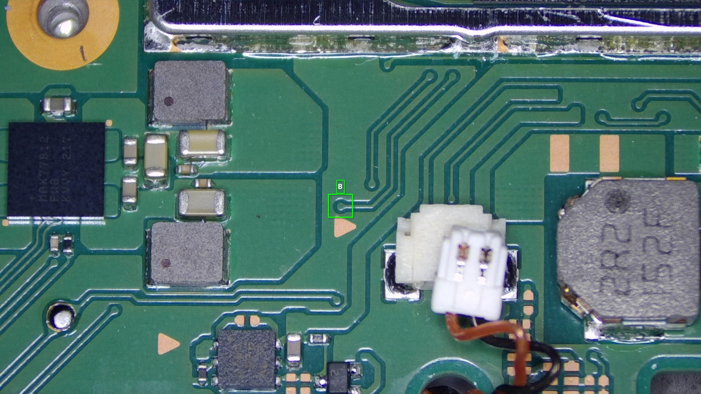
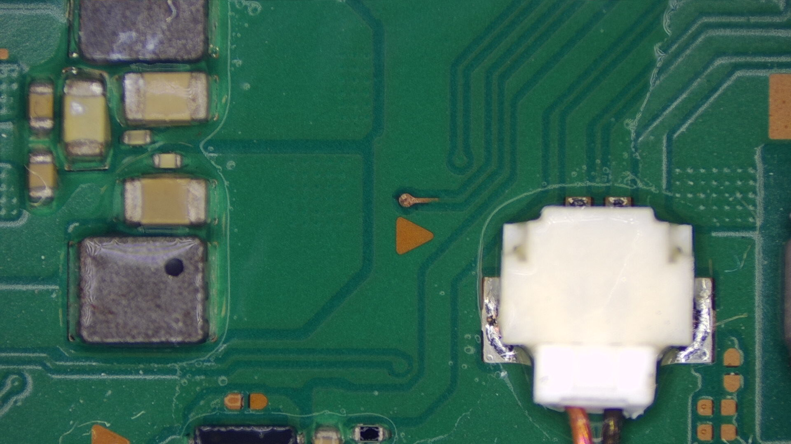
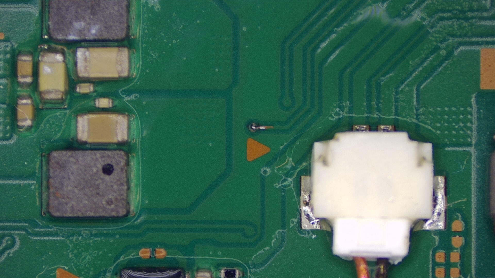
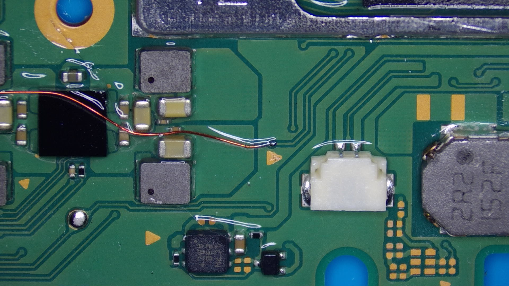

# **Alternative `B` point**

1. Locate the area beneath the RAM/diagonally left above the left speaker connector. You will see a via above the little "arrow", this is the alternative `B` point.
    { loading=lazy }

1. Scrape off the solder mask on top of the via so you're left with exposed copper.
    { loading=lazy }

1. Pre-tin the exposed copper.
    { loading=lazy }

1. Solder your wire to the via.
    { loading=lazy }

#### Everything looking good?

If everything looks good, we will return back to the original installation guide.

[Continue to the main Installation guide :material-arrow-right:](oled.md#b-rst-point-methods){ .md-button .md-button--primary }
