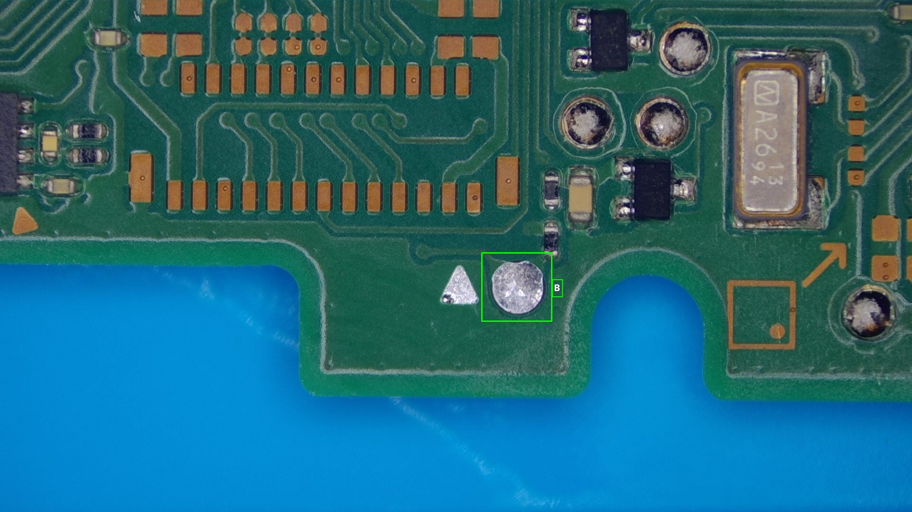
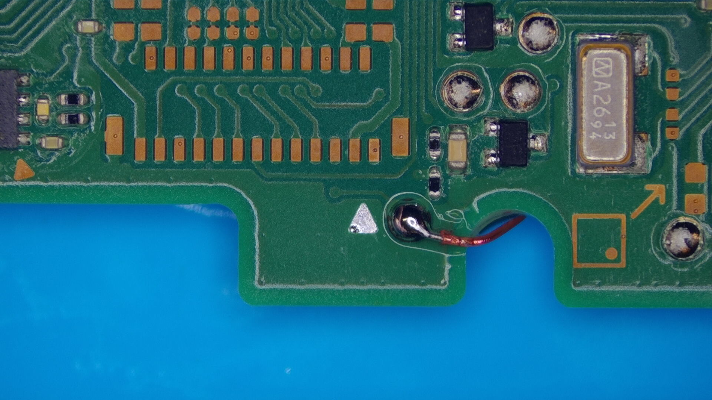

# **Traditional `B` point**

1. Turn the motherboard around and locate the `B` point on the back of the motherboard. It's located at the very bottom of the motherboard, to the left of the C shaped "cutout" for the left speaker wire.
    { loading=lazy }

1. Solder a wire to the `B` point.
    { loading=lazy }

#### Everything looking good

If everything looks good, we will return back to the original installation guide.

[Continue to the main Installation guide :material-arrow-right:](oled.md#b-rst-point-methods){ .md-button .md-button--primary }
