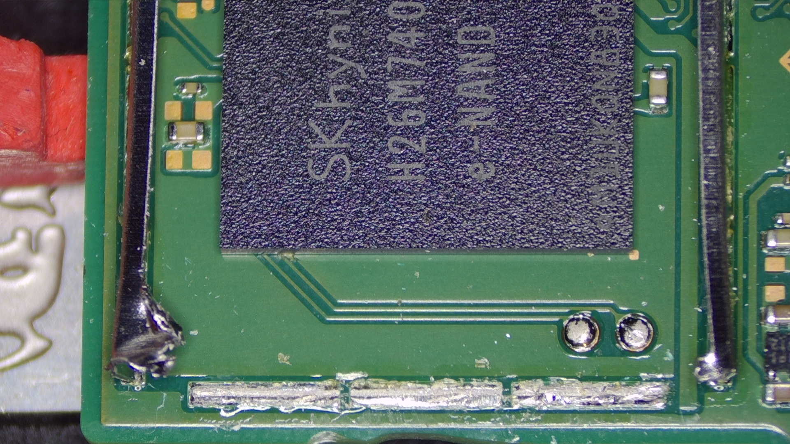
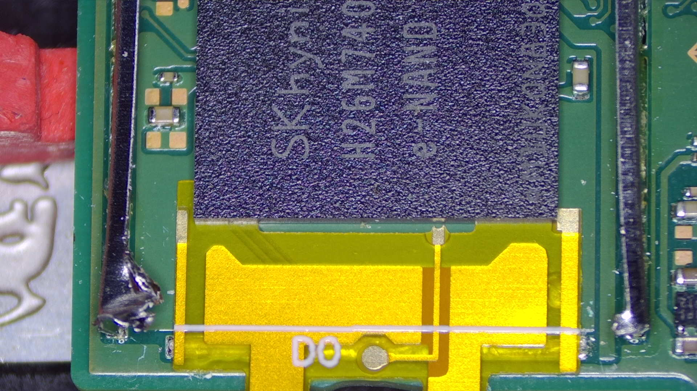
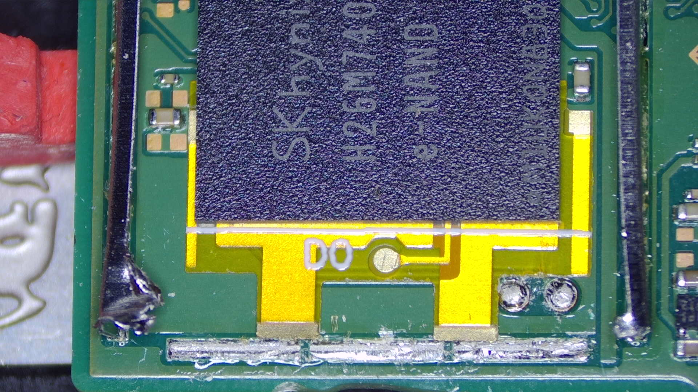

### **DAT0 Adapter Guide**

#### What is the "DAT0 Adapter method"?

With traditional OLED modchip installations, you use a DAT0 adapter that slides underneath the eMMC chip on the back of the motherboard. This method is the easiest and should be used by majority of people, it *can* come at the cost of installation error however. Depending on the skills of the modchip installer, the DAT0 adapter may come "loose" after a while of using it due to thermal cycles (turning the switch on and off). Additionally, these types of adapters can be tricky to install correctly if the console you're modchipping uses an SK hynix eMMC chip. The DAT0 adapter has a little exposed "C" shaped trace that "cups" the DAT0 solder ball underneath the eMMC chip, this is how the contact with the `C` (DAT0) point is formed.

-----

#### Requirements:

- The DAT0 adapter
- Soldering iron
- Flux
- Solder with rosin core
- Tweezers

-----

#### Instructions:

1. Turn the Switch's motherboard around and locate the eMMC chip at the top right of the motherboard.

2. Remove the eMMC's RF (metal) cover

3. Remove a part of the top side of the frame, then slide your DAT0 adapter underneath the eMMC chip until the markings on the adapter line up with the outline of the eMMC chip.

4. Use tweezers to push the DAT0 adapter into the solder ball underneath the eMMC chip (be careful while doing this, don't put too much pressure on it) and solder the anker point of the DAT0 adapter to a part of the anker points the frame was attached to on the motherboard. Make sure you keep pressure on the DAT0 adapter until you've soldered the anker points down. This is your `C`(DAT0) point.

    - **Optional:** Test the `C` point by putting the negative lead of your multimeter on the `C` point of the DAT0 adapter and putting your positive lead on ground. You should end up with a value in between ~`0.450`-`0.850`, generally speaking. This value is measured in Diode mode on a multimeter. (As mentioned at the top of the main installation page, the range differs from console to console and if it works for you, there is no issue.)

-----

#### Everything looking good?:

If everything looks good, we will return back to the original installation guide. Continue from Step 15 onwards.

[Continue to the main Installation guide :material-arrow-right:](oled.md#cdat0-point-methods){ .md-button .md-button--primary }
