# **Flashing the modchip**

### **Information**

Modchips have their own separate firmware version that is separate from the Switch system firmware version, this firmware ultimately determines the functionality and performance of your modchip.
Flashing the firmware to the modchip is not mandatory if your modchip already comes "pre-flashed", but it is recommended to do so.

Any Picofly firmware below version `2.75` is deprecated and is no longer supported, which is why we will be ensuring that the modchip has the latest firmware version (currently `2.80`) flashed to it. This will make sure that you have the best performance and hardware compatibility.

This process is the same for all Picofly modchip models, just use the pictures in the instructions below as reference for your own modchip.

!!! note ""

    **If you're looking to flash your modchip's firmware while it's installed in your Switch console already, see [this page](../extras/alternate_flashing.md).**

-----

#### Please click the tab below for your modchip variant:

=== "Picofly OLED"

    #### What you need:

    - Your Picofly OLED modchip,
    - The micro USB / USB-C debug port that comes with a modchip "set" (image shown in the "Instructions" section below),
    - The latest release of [usk](https://github.com/DefenderOfHyrule/usk/releases) (`firmware.uf2`),
    - A computer or Android phone (computer recommended),
    - A USB type C to USB type A cable / A micro USB to USB type A cable that's capable of data transfer.
        - The type of cable required depends on the modchip revision you have.
        More recently produced Picofly modchips will come with USB type C debug ports.

    #### Instructions:

    1. Position your modchip and included USB debug port in the upwards facing position. This means with the side of the RP2040 microcontroller (the square chip with the Raspberry Pi logo) facing you. This is important    because if you don't do this, you can risk frying the USB circuitry of the modchip. The USB debug port additionally also has `UP` text written on it to indicate the orientation of it.  
    
        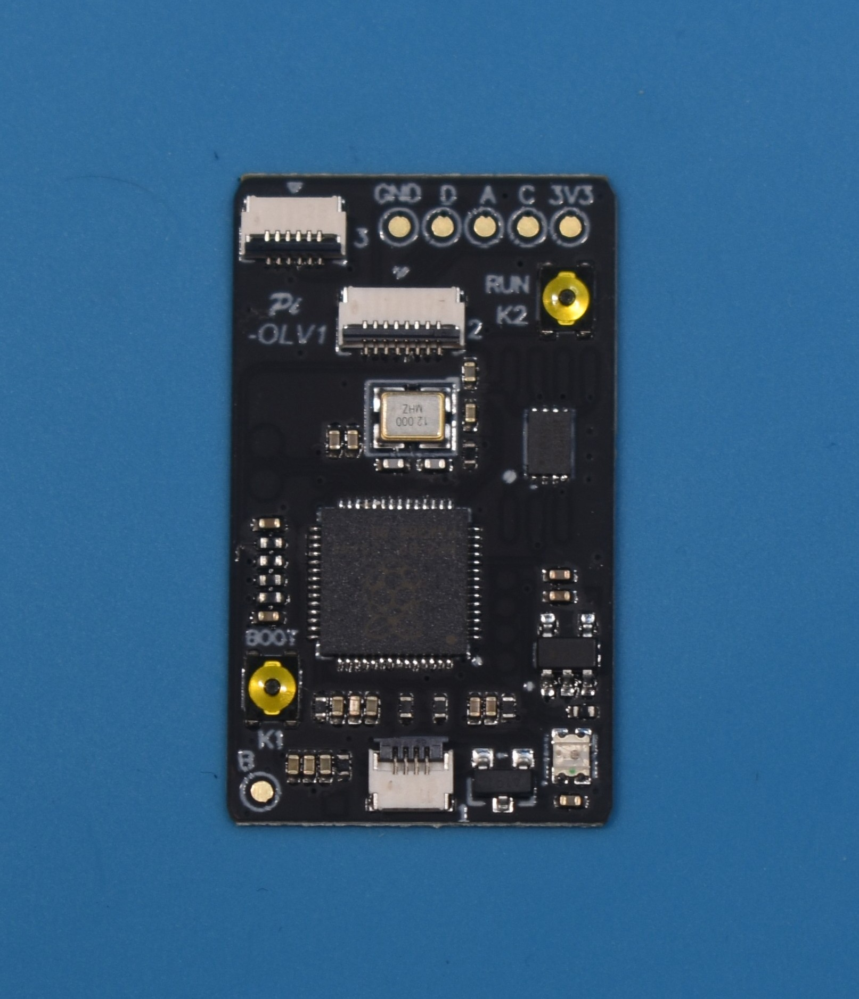{ width="600" loading=lazy }

    1. Lift up the locking tab and plug the USB debug port into the connector at the bottom of your modchip, then lock the locking tab to secure the USB debug port in place.  
    
        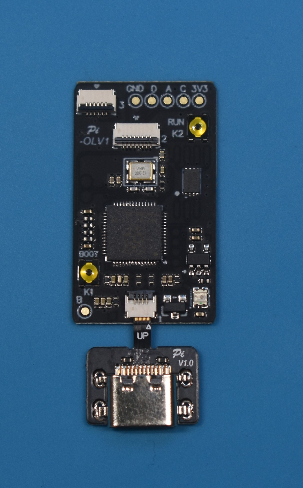{ width="600" loading=lazy }

    1. Hold the `BOOT` button on the modchip and plug the USB debug port into your PC via your data transfer-capable USB cable.  
    
        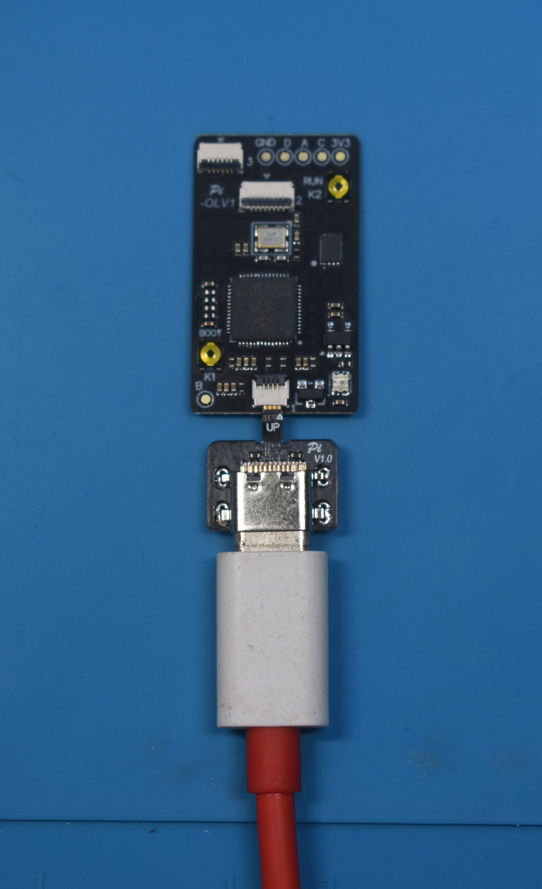{ width="600" loading=lazy }

    1. Your PC should play the "Device connected" sound and a drive should show up on your PC, you should be able to access and open it.  
        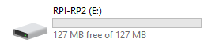

    1. Drag the `firmware.uf2` file into the root of the drive and wait for the file transfer to finish. The drive will eject itself after it's done.  
        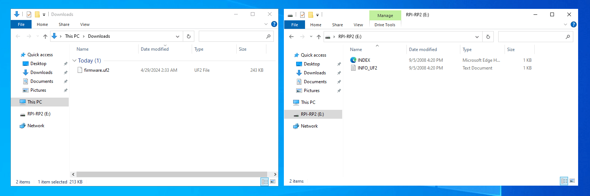

=== "RP2040-Tiny"

    #### What you need:

    - Your stock `RP2040-Tiny` development board,
    - The latest release of [usk](https://github.com/DefenderOfHyrule/usk/releases) (`firmware.uf2`),
    - A computer or Android phone (computer recommended),
    - A USB type A to USB type C cable that's capable of data transfer.
        - The stock `RP2040-Tiny` development board comes with an additional "flashing attachment" board.

    #### Instructions:

    1. Position your modchip and included flashing attachment board in the upwards facing position. This means with the side of the RP2040 microcontroller (the square chip with the Raspberry Pi logo) facing you. This is important because if you don't do this, you can risk frying the USB circuitry of the board. 

        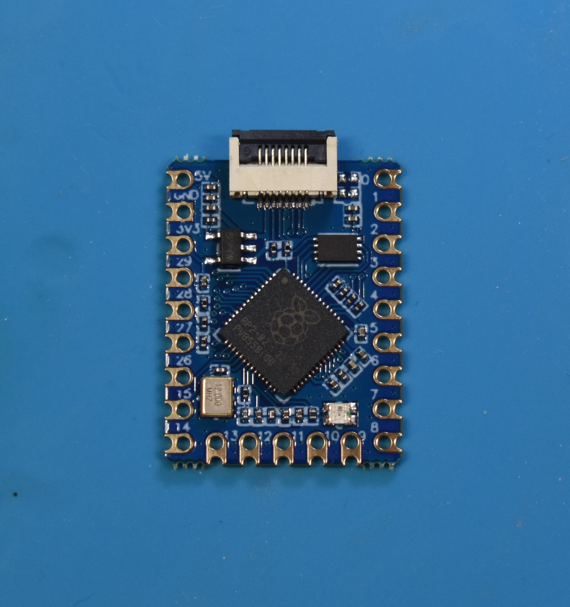{ width="600" loading=lazy }

    1. Lift up the locking tab and plug the flashing attachment board into the connector at the top of your modchip, then lock the locking tab to secure the flashing attachment board in place.  
    
        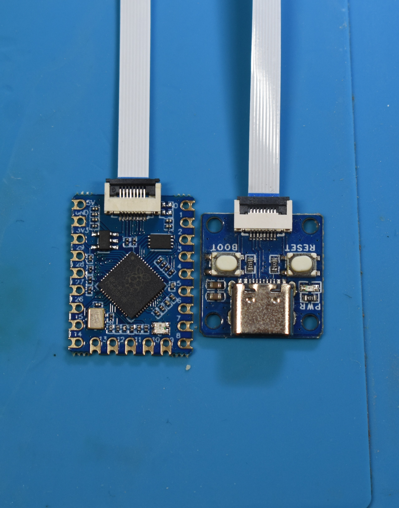{ width="600" loading=lazy }
        
    1. Plug your data-transfer capable USB C cable into the flashing attachment board and hold the the `BOOT` button, then press the `RESET` button.
    
        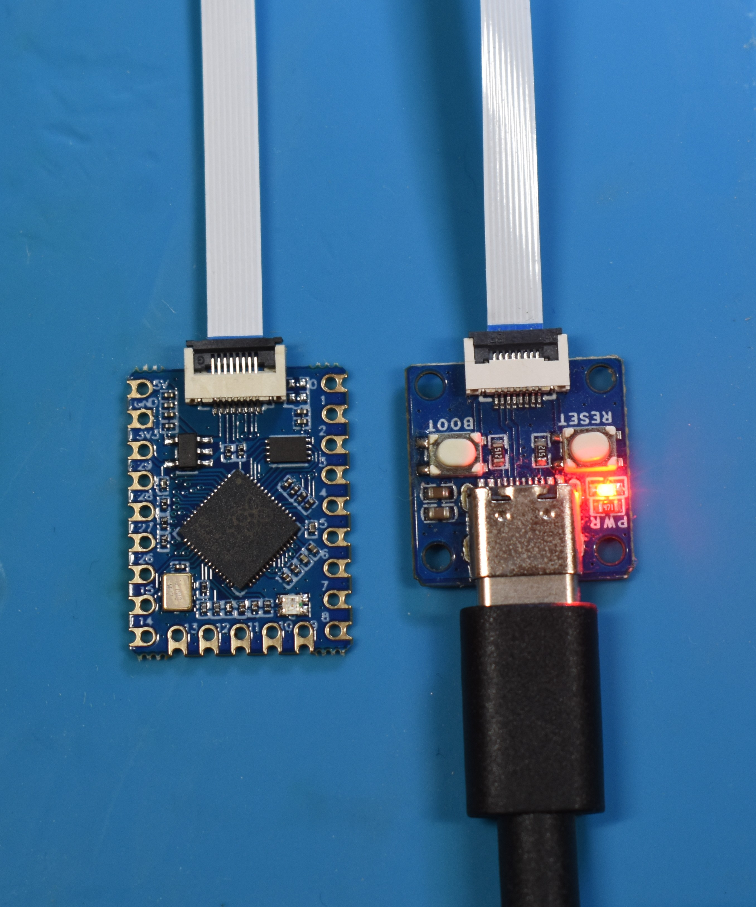{ width="600" loading=lazy }

    1. Your PC should play the "Device connected" sound and a drive should show up on your PC, you should be able to access and open it.  
        

    1. Drag the `firmware.uf2` file into the root of the drive and wait for the file transfer to finish. The drive will eject itself after it's done.  
        

    1. The modchip will blink green once and then give you a Picofly error code in red (as it isn't connected to anything besides power), this is normal and you can continue.    
        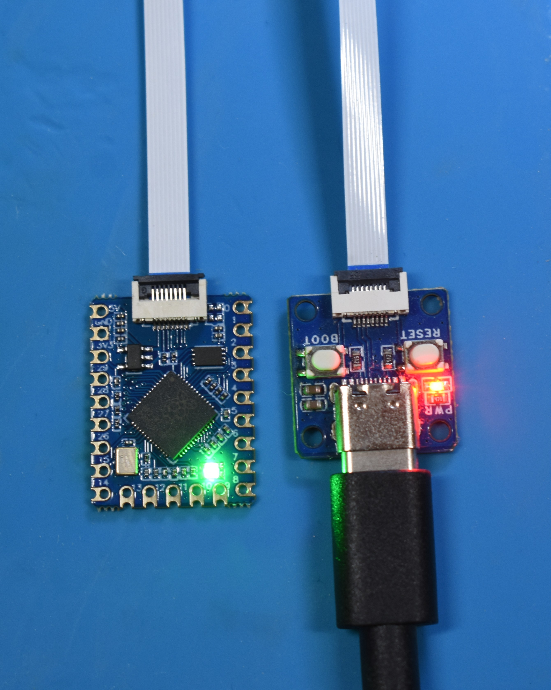{ width="600" loading=lazy }
        
        1. **Optional:** Now, you will likely want to desolder the FPC port at the top of the board, as it now no longer serves a purpose and makes the footprint of the board smaller (allowing for a more "sleek" installation later).
        
            - You can also desolder the linear regulator, as it also no longer serves a purpose after flashing the RP2040.
            
            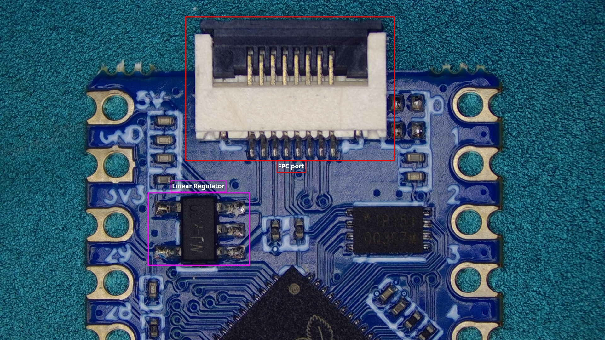{ width="600" loading=lazy }
            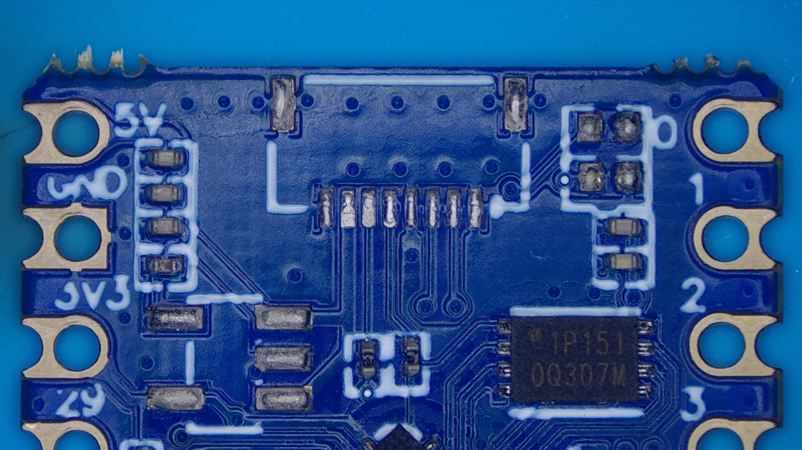{ width="600" loading=lazy }

#### Your modchip is now flashed with the latest firmware version, proceed with the modchip installation for your model of Switch console by pressing the relevant button below.

[Continue to Modchip installation Switch :material-arrow-right:](normal.md){ .md-button .md-button--primary }

[Continue to Modchip installation Switch Lite :material-arrow-right:](lite.md){ .md-button .md-button--primary }

[Continue to Modchip installation Switch OLED :material-arrow-right:](oled.md){ .md-button .md-button--primary }

??? warning "About flashing Hwfly/SX series modchips"

    Instructions on how to flash Hwfly/SX series differ a tiny amount from Picofly modchips, they don't have the `BOOT` button and only require you to plug them into your PC to flash them.

    #### Instructions:

    1. Download the `.zip` file from the link below and extract the `.zip` file to a location on your PC:

        - [hwfly-firmware](https://github.com/hwfly-nx/firmware/releases/download/0.7.2/release_072.zip)

    1. Position your modchip and included USB debug port in the upwards facing position. This means with the side of the microcontroller (the biggest square chip) facing you. This is important because if you don't do this, you can risk frying the USB circuitry of the modchip. The USB debug port additionally also has `UP` text written on it to indicate the orientation.  
    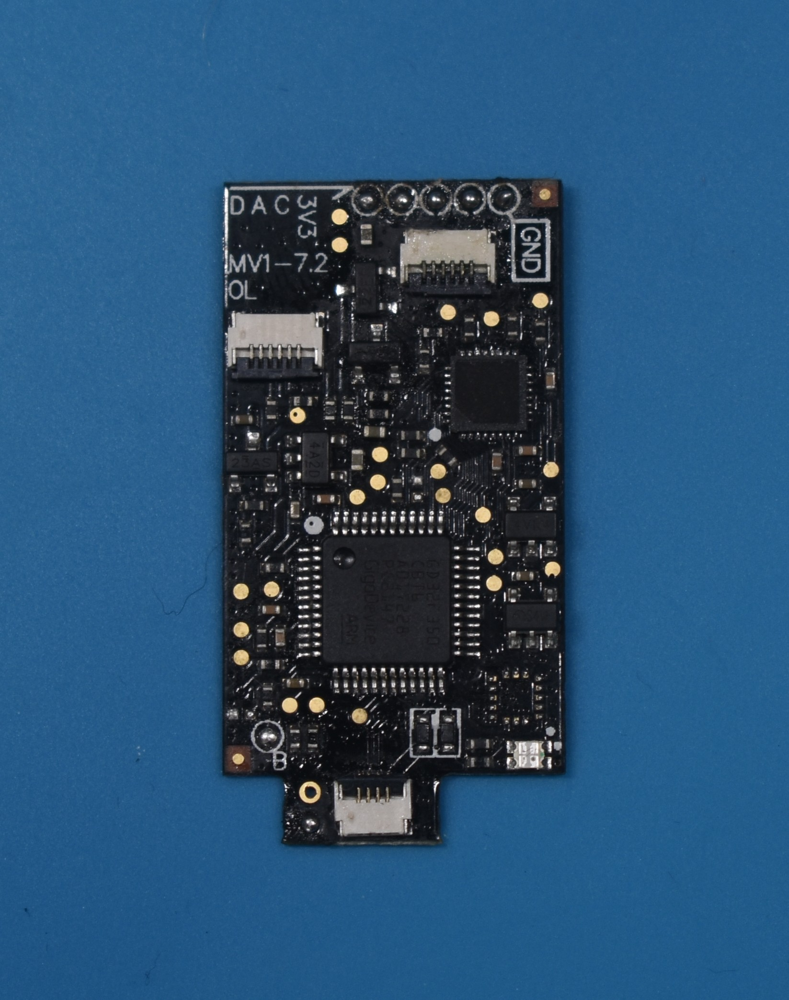{ width="600" }

    1. Lift up the locking tab and plug the USB debug port into the connector at the bottom of your modchip, then lock the locking tab to secure the USB debug port in place.  
    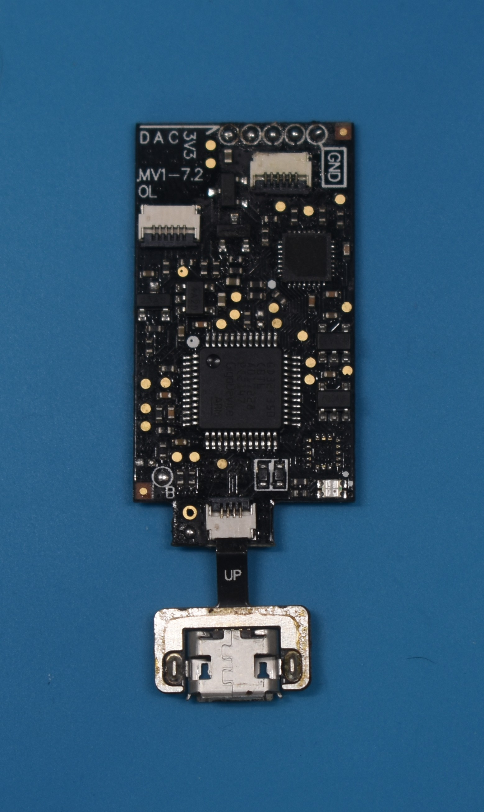{ width="600" }

    1. Plug the USB debug port into your PC via your data transfer-capable USB cable.
       your PC should play the "Device connected" sound, which indicates that it's plugged in correctly. 
           - **Note:** The modchip will flash blue as soon as it's connected to a power source if the modchip was flashed with spacecraft-nx or hwfly-nx previously. This indicates that it's awaiting USB input. 
       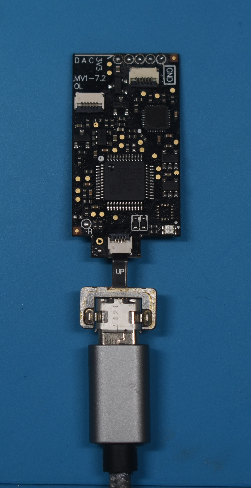{ width="600" }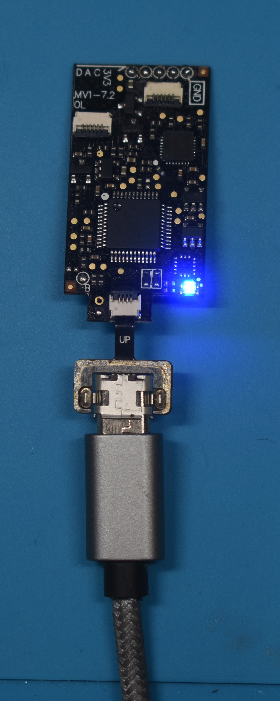{ width="600" } 

    1. Open the extracted folder from earlier and run `flash.bat`.

    1. Wait for the script to finish, it will tell you when it's done and prompt you to press a key to exit the flashing script.
    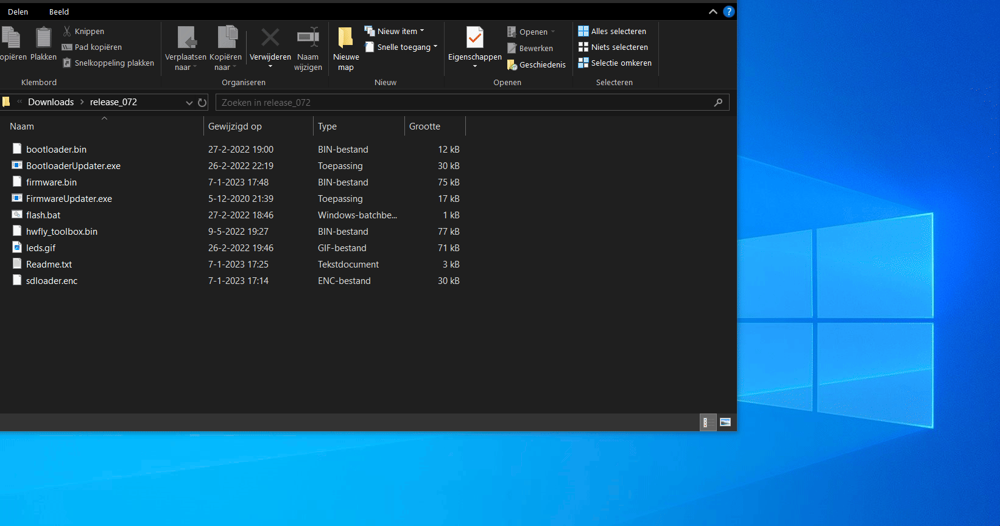 

        !!! warning "About "Spacecraft-NX `DFU` not found!""
            If the flashing script says that the Spacecraft-NX `DFU` was not found, wait for Windows to finish setting up the device. This can take a minute, so be patient and don't panic.  

    1. Your modchip is now flashed with the latest firmware version.

