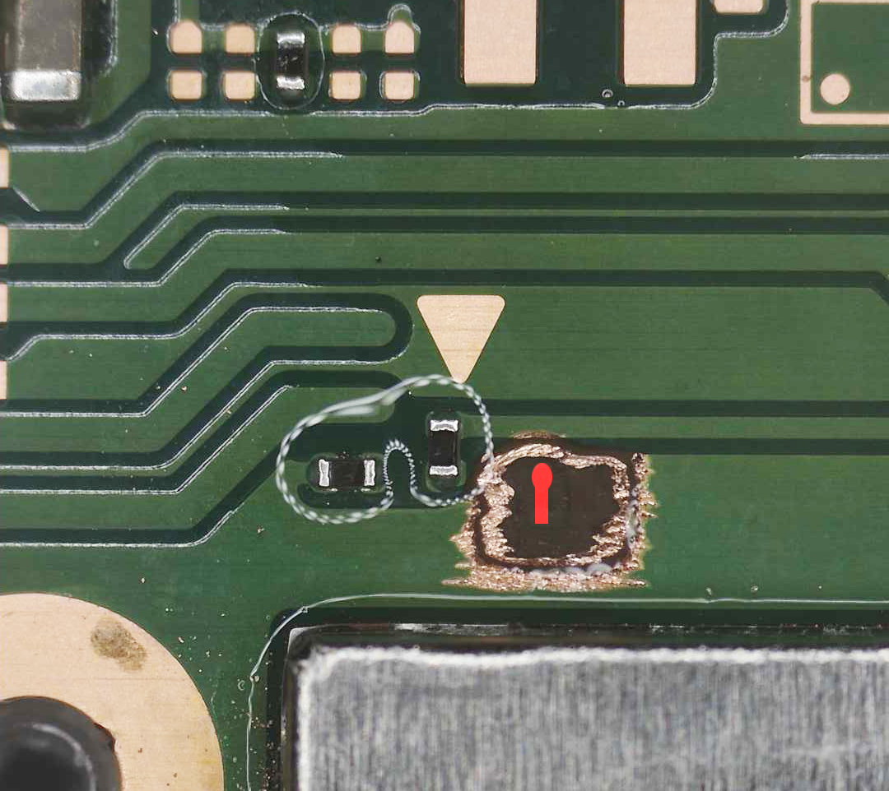
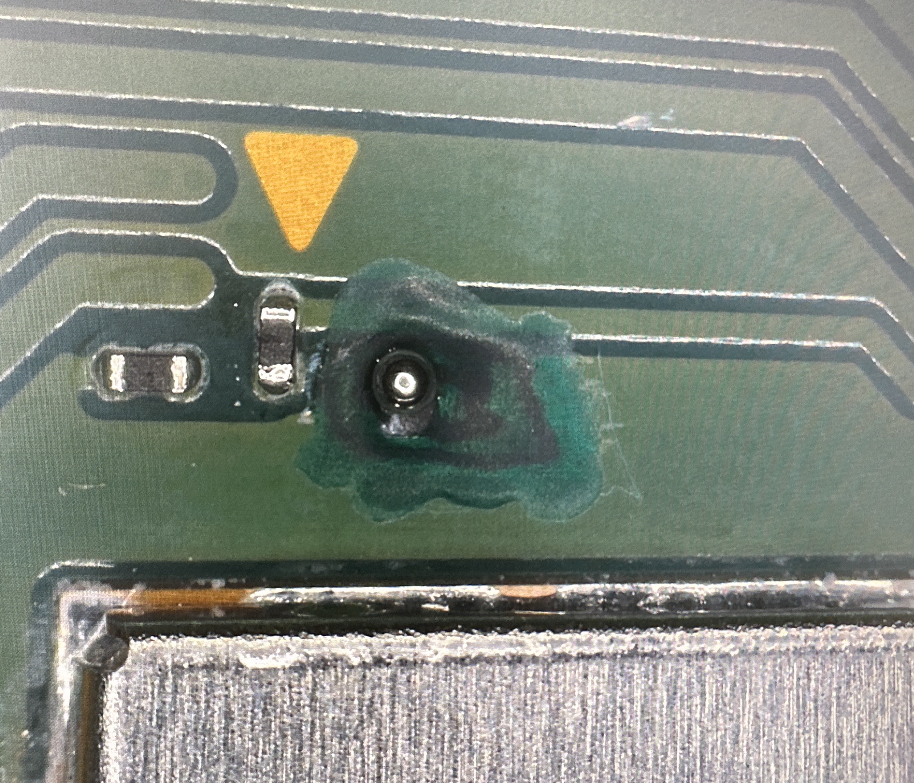
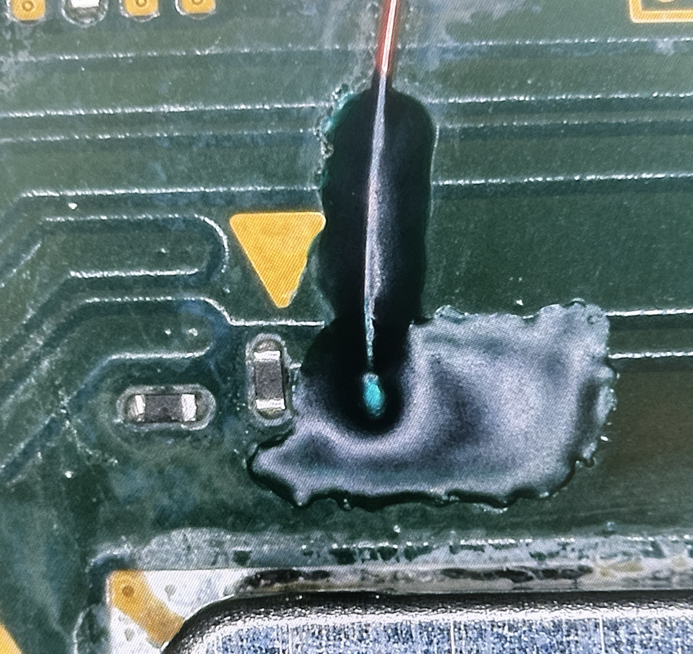

### **Switch OLED Kamikaze Guide**

#### What is the “Kamikaze method”?

The Kamikaze method introduces a new way to make a connection to the `C` (DAT0) point without
the need of a DAT0 adapter or interposer board. This process requires grinding down to the third layer of the
motherboard to expose the DAT0 trace, which we can then pre-tin and solder to. It comes with the
very high risk of completely bricking your device if you do not have the required skills. Please do not attempt this if you do not have the required experience and follow the [DAT0 Adapter method](dat0-adapter.md) instead.

**Credit:** This page was created in a collaboration between Stashboy and I, photos and instructions were taken/written by Stashboy and were slightly modified by me for implementation in this guide.

-----

#### Requirements:

- Microscope with sufficient lighting
- Grinding pen with a 0.2mm tip
- Multimeter
- UV Solder mask
- UV Light
- Solder with rosin core, preferably 0.8mm in diameter or less
- Soldering iron (with a tip like the `TS-J02`)
- Flux
- Tweezers
- Enameled/Magnet wire: 32-36 awg
- IPA: 90-99%
- Q-tips or cleaning wipes
- Hot air rework station (optional)
- Low melt solder paste (optional)

-----

#### Now, let’s dive in:

1. First, start off by identifying the area of the board you will be grinding. The trace
is located exactly 1mm away from the `A`(CMD) point. Refer to the red outline in the photo
below for a visual reference.

2. Apply Flux or IPA to the grinding area to keep debris from scattering all over the
board.

3. Begin grinding an outline that you’re going to stay within throughout the process.

4. Expose the entire first layer and do not forget to keep applying Flux or IPA to
keep the area wet. Grind evenly and take your time! Continue grinding away the
first layer.

5. After grinding away the first layer, you should now have reached a brown
interposer layer. These layers consist of silicon/fiberglass and will reside in
between all layers of the motherboard. Continue grinding through it.

6. We have now reached the second layer. This is where the process gets very
risky. Grinding too far down can result in your console being bricked. Take your
time and grind evenly!

7. This is now the second interposer layer. The trace we’re looking for is right
underneath it. You can apply Flux or IPA to see the traces, there are a few. We’re
looking for the trace that has a circular tip towards CMD/A. Refer to the photo for
reference. Once you’ve successfully located the trace, start to grind only the
circular part of the trace to expose it. Grinding too deep will completely brick
your system, take your time!!!

8. Once the trace is exposed, clean the area completely. It will look very dry, that is
perfectly fine. Now give the system a test boot to make sure you’ve successfully
exposed the trace without bricking the system.
    - **Optional:** Test the `C` point by putting the negative lead of your multimeter on the exposed DAT0 trace and putting your positive lead on ground. You should end up with a value in between ~`0.450`-`0.850` generally, speaking. This value is measured in Diode mode on a multimeter. (As mentioned at the top of the main installation page, the range differs from console to console and if it works for you, there is no issue.)

9. Apply UV solder mask to the exposed area, however, leave the DAT0 trace uncovered.
Cure the UV solder mask using a UV Light for 1 to 3 minutes depending on the quality and strength of your light.

10. You should now have a masked area, with an exposed DAT0 trace. We can now apply solder to the exposed DAT0 trace.
    - **Alternatively:** You can also apply low melt solder paste to the exposed trace and use your hot air station to form
    the paste into a solder ball on the trace.

     

11. Cut a piece of enameled/magnet wire, pre-tin it, then proceed to adding flux to the solder
ball you’ve created. You can now use your tweezers and soldering iron to guide the wire
onto the solder ball. Remember, we’re three layers down. It will take a decent
amount of heat (~350-360C) to melt the solder and successfully get the wire to stick to the point. If the connection is weak but
there, add some solder mask to the wire to hold it in place. You can now apply a
bit more solder to form a better connection.
    - **Alternatively:** You can apply low melt solder and use hot air once again to form a better connection.

12. You should now have a wire soldered onto the trace successfully. Apply solder
mask to cover the entire area, then cure it for 1 to 3 minutes and continue on to
the rest of your modchip installation!

-----

#### Everything looking good?:

If everything looks good, we will return back to the original installation guide. Continue from Step 15 onwards.

[Continue to the main Installation guide :material-arrow-right:](oled.md#cdat0-point-methods){ .md-button .md-button--primary }
