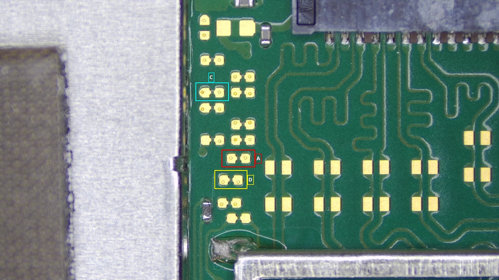
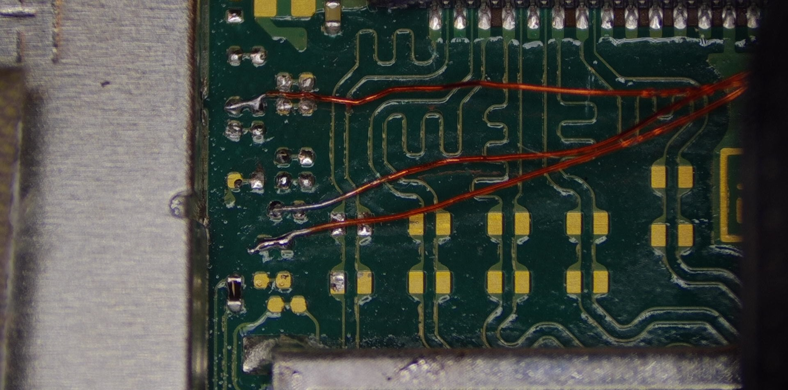
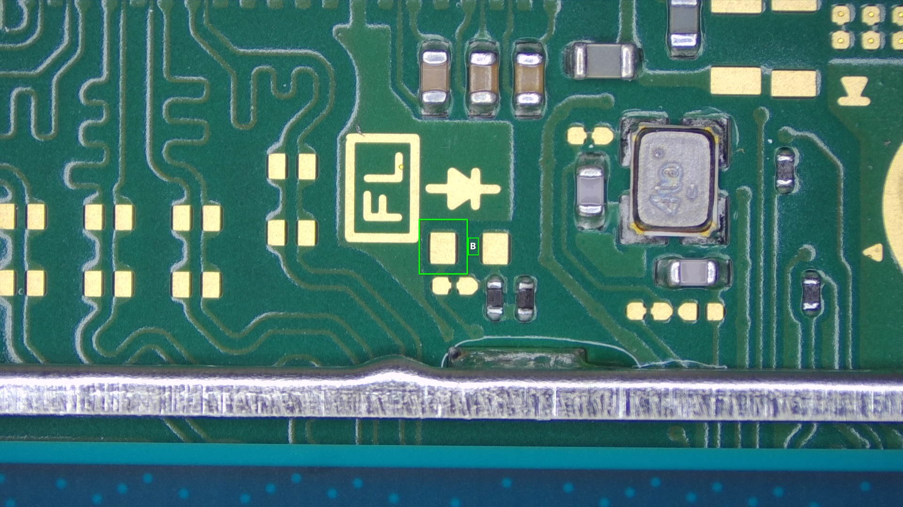
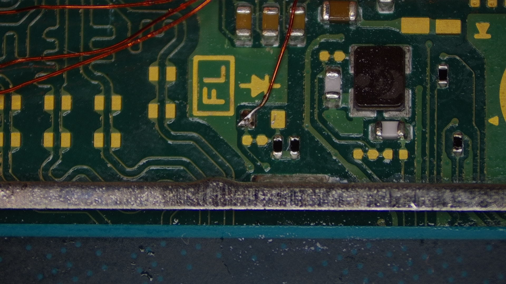
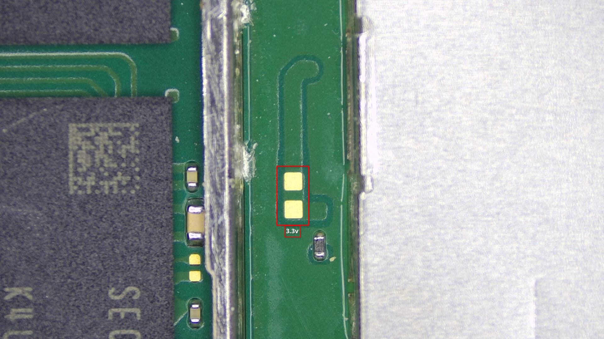
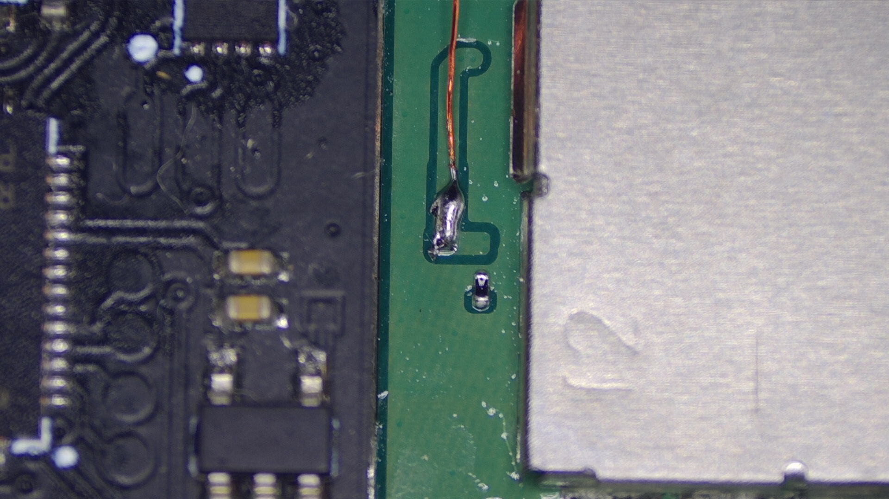
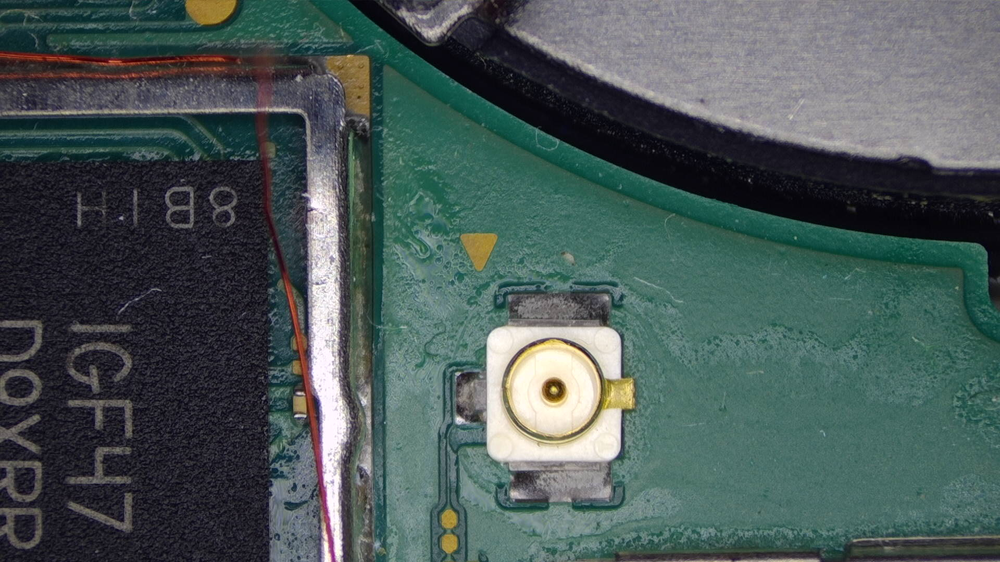
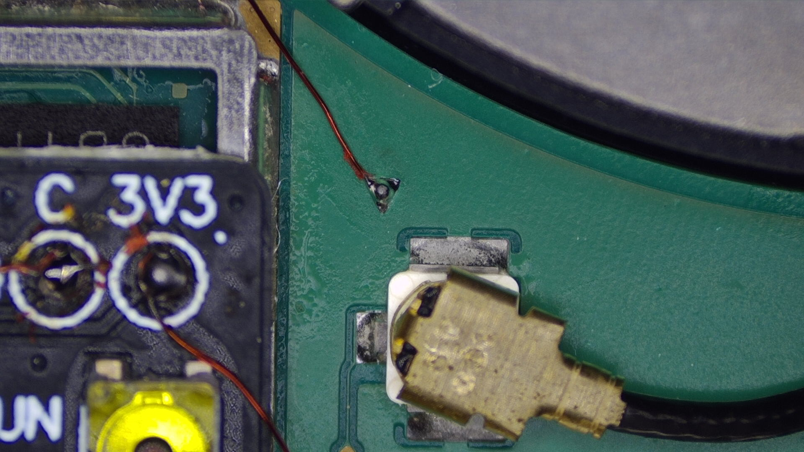
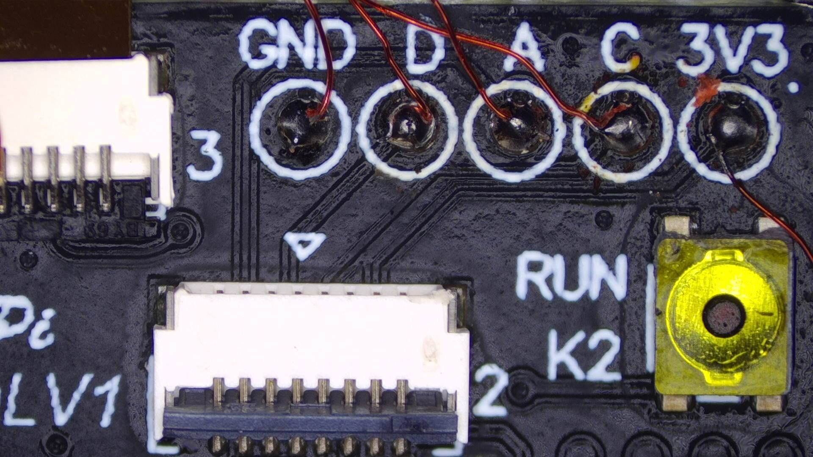
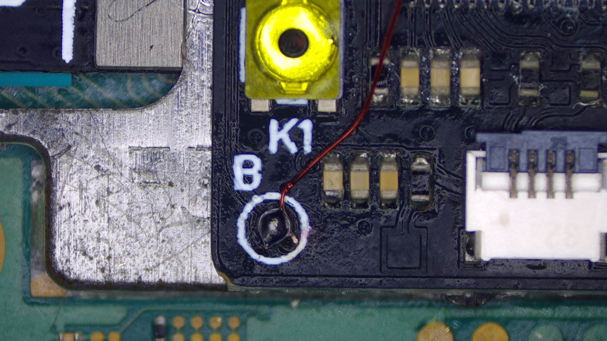

---
hide:
  - navigation
  - toc
---

# **Switch Modchip Walkthrough - Switch Lite**

### **The Installation**

This page will guide you through the modchip installation process on "Lite" model Switch consoles. Everything you need will be listed and pictures of what your solder joints should (roughly) look like will be posted by each step.
Specific steps such as photos of the screws you need to unscrew aren't mentioned here as they can be found on guides from iFixit (for example). It's expected for you to know what to unscrew.

-----

#### Diode reading values

These values can differ from console to console. If your modchip installation works fine and doesn't match these exact values, it's not an issue. These values can act as "indicators" about what you might expect.

| Positive to ground        | Negative to ground           |
| ------------------------- | ---------------------------- |
| **SP1** `~0.125`          | **SP1** `~0.125`             |
| **SP2** `~0.12`           | **SP2** `~0.10`              |
| **A** (CMD) `~0.470`      | **A** (CMD) `~0.875`         |
| **B** (RST) `~0.405`      | **B** (RST) `OL`             |
| **C** (DAT0) `~0.435`     | **C** (DAT0) `~0.450-0.850`  |
| **D** (CLK) `~0.440`      | **D** (CLK) `~0.880`         |
| **3.3v** `~0.445`         | **3.3v** `~0.850`            |

#### Requirements:

- A soldering iron with a small(er) tip (preferably temperature controlled that can reach 350C consistently)
- Good quality flux
- The right screwdriver bits (+00 and Y1.5 bits)
- Good quality 34-38 awg wire (such as Kynar wire, other wire can work as long as it's single core)
- Thermal paste (non-conductive)
- Isopropyl Alcohol (preferably 95-99% IPA)
- Your modchip (including the SoC ribbon cable)
- Kapton tape (optional, but recommended)
- Toothpicks/Q-tips (to remove the thermal paste between the capacitors on the SoC)
- Soldering tin (leaded is recommended, unleaded will work depending on your skill level)
- Double sided tape (for adhering the modchip to the SoC/RAM IHS)
- A fume extractor (for your own health and safety)
- A microscope (optional but recommended)
- UV Solder mask (optional but recommended)

??? warning "Note for stock `RP2040-Tiny` development board users"

    #### The pinout for the modchip lines of the `RP2040-Tiny` board are outlined and named in the image below.
    
    !!! info "In case you want the pinout in text form:"
    
        - GPIO Pin 29: C (`DAT0`)
        - GPIO Pin 28: A (`CMD`)
        - GPIO Pin 27: D (`CLK`)
        - GPIO Pin 26: B (`RST`)
        - GPIO Pin 15: CPU (`SP1`/`SP2`)
    
    { loading=lazy }
    
#### Instructions:

1. Unscrew the Switch's backplate.
     { loading=lazy }
     { loading=lazy }

1. Remove the metal shield/cover.
     { loading=lazy }

1. Remove the heatpipe/heatsink.
     { loading=lazy }

1. Remove the IHS (Internal Heat Spreader) to expose the bare SoC die and RAM chips.
     { loading=lazy }

1. Remove and clean up the thermal paste on the SoC die and around/in-between the capacitors on the SoC using IPA.
       - You can also clean off the thermal paste between the IHS and heatpipe/heatsink in the meantime, the red-ish colored thermal goop between the heatpipe/heatsink and metal shield/cover can be left alone.

     { loading=lazy }

1. Place the SoC ribbon cable and align the ribbon cable with the capacitors on the SoC.

    ??? danger "Note regarding the SoC ribbon cable (Click to unfold)"
    
        1. #### If your SoC ribbon cable is too short or you use an `RP2040-Tiny` development board, you cannot plug into the modchip directly. To make it work regardless, you can just solder a wire to the two middle pins of the ribbon cable (as pictured below).
        
        
        
        1. #### The "premade" Picofly OLED modchips will usually have a dedicated exposed pad on it that you can solder a wire to. You can view this pad below as well.
        
        
        
        
            - **Note:** If your modchip model does not have this dedicated pad, you can simply scrape off some solder mask off of the `SP1`/`SP2` trace on the modchip and solder directly to said trace.
            
            - If you use the `RP2040-Tiny`, it has a dedicated GPIO pin (pin 15). You can refer to the pinout at the [very top of this page](#the-pinout-for-the-modchip-lines-of-the-rp2040-tiny-board-are-outlined-and-named-in-the-image-below)
     
1. Tuck the anchor points underneath the metal frame below the SoC and the MOSFET section of the ribbon cable underneath the frame between the SoC and RAM.
            
     { loading=lazy }
     { loading=lazy }

1. Apply flux and use your soldering iron to heat up the end of each capacitor together with the respective pad next to both ends of each capacitor of the `SP1` and `SP2` points, ensure the solder flows between the pad on the ribbon cable and each end of the capacitors.
     { loading=lazy }

1. Your ribbon cable should now be secured in place with both ends of each capacitor soldered to the pads on the ribbon cable.
       - **Optional:** Place Kapton tape across your solder joints to prevent thermal paste from potentially corroding your solder joints in the future. It also helps in cases where you might have to rework your solder joints.
       { loading=lazy }
       
1. Move on to the area diagonally left above the SoC. In the image below, the required pads are outlined and named. 

    The names for each point are the following:
    
    - **C:** DAT0
    - **A:** CMD
    - **D:** CLK

    **Note:** Each set of two pads are horizontally connected to each other. Bridging them will not cause any harm and is also the recommended thing to do.
    
      { loading=lazy }
      
1. Solder the wires onto each point now. Make sure there's a solid connection between the pads on the board and your wire. I've scraped the mask off of the via at the `B` point to make it easier to solder to.

      { loading=lazy }      

1. Move on to the area directly above the SoC and solder your wire and solder it to the `B` (RST) pad on the motherboard.

      { loading=lazy }
      { loading=lazy }
    
1. Now we will move onto the `3.3v` point. I personally recommend using the exposed `3.3v` pads directly to the right of the RAM.

      { loading=lazy }
      { loading=lazy }

1. Finally, we will move onto the `GND` (ground) point. You can use *any* ground point on the board, but I prefer/recommend using the "arrow" on the ground plane above the left antenna terminal.

      { loading=lazy }
      { loading=lazy }

1. Modify the left side (right side in the image below, as the IHS is upside down) of the IHS so that the SoC ribbon cable can fit through the left side of the IHS.

      { loading=lazy }

1.  Wire up the modchip. Place something non-conductive between the modchip and RAM chips, then power the console on. The modchip will pulse blue/light blue a couple of times (glitching), then yellow (success). You should end up at a `No SD Card` splash screen with the Picofly logo after the modchip blinks yellow once.
      - **Note:** Getting to the `No SD Card` screen does not *always* indicate success. Sometimes solder joints or electrical connections may be good enough for glitching but not for booting HOS (HorizonOS), please ensure that you test if your console boots by ensuring the console is off, then holding both volume buttons and pressing the power button once, letting go of the volume buttons when you see the Nintendo logo. If your Switch does *not* boot normally, please check if your console boots by removing the modchip (*not* the SoC ribbon cable) and turning the console on normally. If you still experience issues related to glitching/training (such as a *red* error code), refer to the [troubleshooting page](../troubleshooting/error_codes.md#error-codes-for-picofly).
      
    !!! warning "Note for stock `RP2040-Tiny` development board users"
    
        Please refer to the pinout at the [very top of this page](#the-pinout-for-the-modchip-lines-of-the-rp2040-tiny-board-are-outlined-and-named-in-the-image-below).

    { loading=lazy }
    { loading=lazy }

      { loading=lazy }

1. If everything looks as expected (like the image below), you can continue.

      { loading=lazy }
      
1. Reassemble the console (don't forget to apply thermal paste!) until you're at the point of putting the metal shield/backplate back in place. The modchip will not fit underneath the metal shield/backplate so you will need to cut a strip out of it, how I personally do this is by using regular scissors and cutting out the middle section. You should also make sure that you place an adhesive between the modchip and IHS, so that the modchip is secured in place and doesn't move around when you use the console.
     { loading=lazy }
     { loading=lazy }

1. Once the console is fully reassembled and you turn it on, you should still end up at the `No SD Card` splash screen. You've successfully installed the modchip.

      { loading=lazy }
      { loading=lazy }
      { loading=lazy }

-----

#### What's next?

From here, if you get the same result as I did, you can continue following the NH Server guide to set up CFW by clicking the button below. If you want to know more about the functionality of modchips, visit the [**Functionality of modchips**](../functionality/functionality_of_modchips.md) page.

If you'd like to donate to me, visit the [**Credits**](../credits/credits.md) section.

[Continue to the NH Server guide :material-arrow-right:](https://switch.hacks.guide/){ .md-button .md-button--primary }

!!! danger ""
    If you didn't get the same result as I did and are running into issues, please follow the troubleshooting section of this guide.
    It can be found [here](../troubleshooting/error_codes.md).
