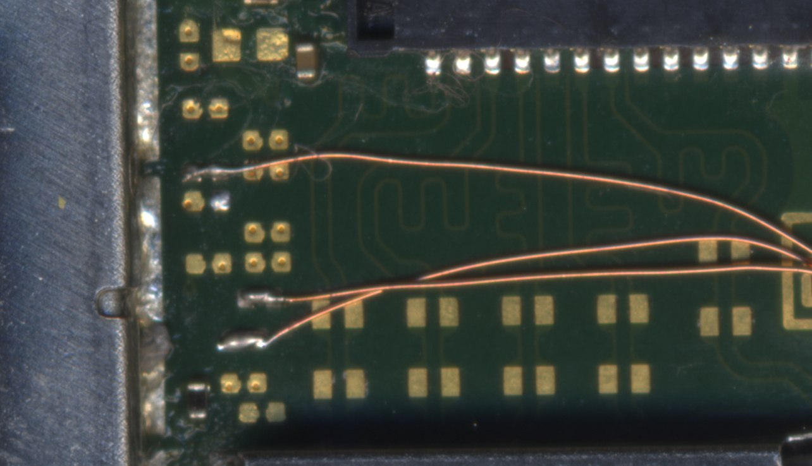
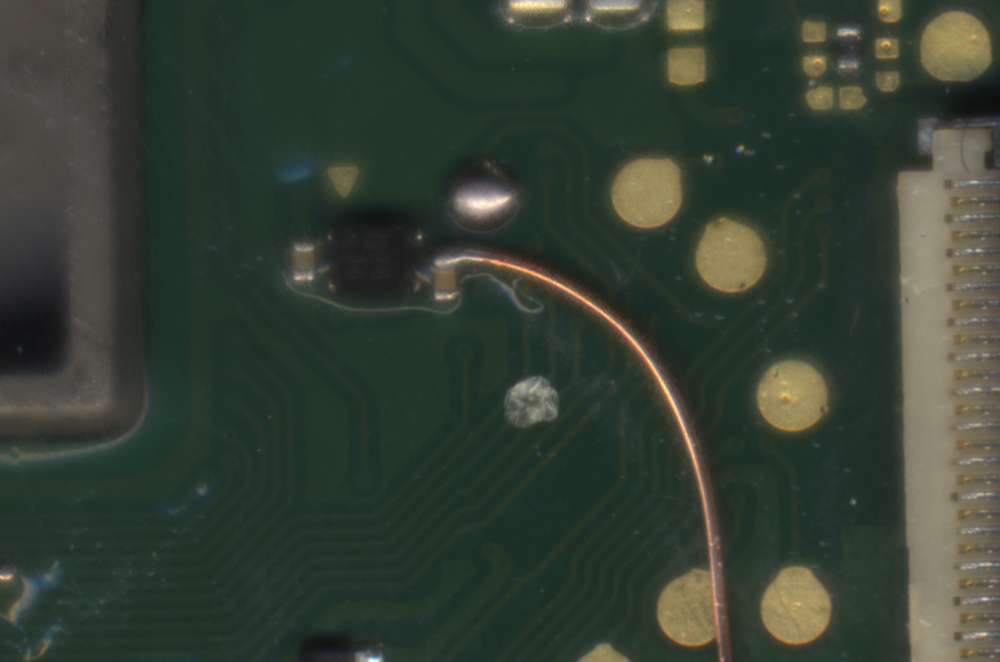
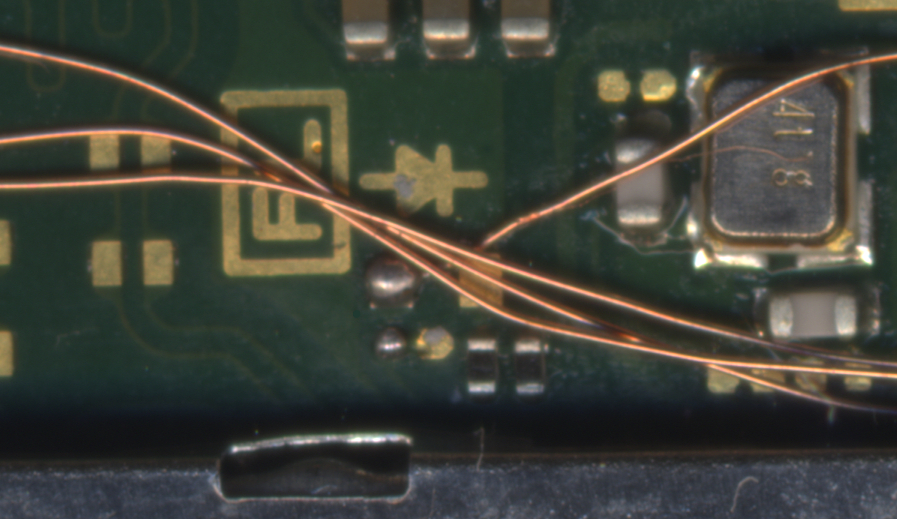

---
hide:
  - navigation
  - toc
---

### **The Installation**

This page will guide you through the modchip installation process on "Lite" model Switch consoles. Everything you need will be listed and pictures of what your solder joints should (roughly) look like will be posted by each step.
Specific steps such as photos of the screws you need to unscrew aren't mentioned here as they can be found on guides from iFixit (for example). It's expected for you to know what to unscrew.

-----

#### Diode reading values

These values can differ from console to console. If your modchip installation works fine and doesn't match these exact values, it's not an issue. These values can act as "indicators" about what you might expect.

| Positive to ground        | Negative to ground           |
| ------------------------- | ---------------------------- |
| **SP1** `~0.125`          | **SP1** `~0.125`             |
| **SP2** `~0.12`           | **SP2** `~0.10`              |
| **A** (CMD) `~0.470`      | **A** (CMD) `~0.875`         |
| **B** (RST) `~0.405`      | **B** (RST) `OL`             |
| **C** (DAT0) `~0.435`     | **C** (DAT0) `~0.450-0.850`  |
| **D** (CLK) `~0.440`      | **D** (CLK) `~0.880`         |
| **3.3v** `~0.445`         | **3.3v** `~0.850`            |

#### Requirements:

- A soldering iron with a small(er) tip (preferably temperature controlled that can reach 350C consistently)
- Good quality flux
- The right screwdriver bits (+00 and Y1.5 bits)
- Good quality 30-32 awg wire (such as Kynar wire, other wire can work as long as it's single core)
- Thermal paste (preferably non-conductive)
- Isopropyl Alcohol (preferably 95-99% IPA)
- Your modchip (including the SoC ribbon cable)
- Kapton tape (optional, but recommended)
- Toothpicks/Q-tips (to remove the thermal paste between the capacitors on the SoC)
- Soldering tin (leaded is recommended, unleaded will work depending on your skill level)
- Double sided tape
- A fume extractor (for your own health and safety)
- A microscope (optional but recommended)
- UV Solder mask (optional but recommended)

??? note "Note for stock RP2040 Zero development board users"
     If you use a stock `RP2040 Zero` development board, you will need to desolder the USB-C port,`BOOT` and `RESET` buttons before continuing. You'll also need to purchase the SoC ribbon cable separately together with 5x `0805 47Ω +-1%` resistors (5x is recommended, 3x is possible in some instances).
     The resistors can be purchased on AliExpress or websites like Digikey or Mouser Electronics. The SoC ribbon cable can be purchased from AliExpress.

#### Instructions:

1. Unscrew the Switch's backplate.
     
     

2. Remove the metal shield/cover.
     

3. Remove the heatpipe/heatsink.
     

4. Remove the IHS (Internal Heat Spreader) to expose the bare SoC die and RAM chips.
     

5. Remove and disconnect the Gamecard reader, then remove and clean up the thermal paste on the SoC die and around/in-between the capacitors on the SoC using IPA.
       - You can also clean off the thermal paste between the IHS and heatpipe/heatsink in the meantime, the red-ish colored thermal goop between the heatpipe/heatsink and metal shield/cover can be left alone.

     

6. Apply flux and pre-tin the pads labeled `SP1` and `SP2` on the SoC ribbon cable.
     
     

7. Place the SoC ribbon cable and align the ribbon cable with the capacitors on the SoC.
     
     

8. Tuck the anker points underneath the metal frame below the SoC and the MOSFET section of the ribbon cable underneath the frame between the SoC and RAM, then solder the ribbon cable down once lined up correctly.

9. Apply flux and use your soldering iron to heat up the end of each capacitor together with the respective pad next to both ends of each capacitor of the `SP1` and `SP2` points, ensure the solder flows between the pad on the ribbon cable and end of the capacitor.

10. Your ribbon cable should now be secured in place with both ends of each capacitor soldered to the pads on the ribbon cable.
       - **Optional:** Place Kapton tape across your solder joints to prevent thermal paste from potentially corroding your solder joints in the future. It also helps in cases where you might have to rework your solder joints. (I *did* do this but didn't take a photo of it.)

     

11. The following pads are located directly to the right of the metal eMMC cover/frame.  
     
    Tin the end of your wire and solder it to the `C` (DAT0, in red) pad(s) on the motherboard. Be careful that you don't bridge the pads next to-, above and below these two pads. Solder this piece of wire to the `C` pad on the modchip.  
     
    Tin the end of your wire and solder it to the `A` (CMD, in green) pad(s) on the motherboard. Be careful that you don't bridge the pads next to-, above and below these two pads. Solder this piece of wire to the `A` pad on the
    modchip. 
     
    Tin the end of your wire and solder it to the `D` (CLK, in blue) pad(s) on the motherboard. Be careful that you don't bridge the pads next to-, above and below these two pads. Solder this piece of wire to the `D` pad on the modchip.  
       - **Note:** Each set of two pads are horizontally connected to each other. Bridging them will not cause any harm and is also the recommended thing to do.
    
    

12. This capacitor is located next to the bottom right of the Gamecard reader's plastic frame.  
     
    Tin the end of your wire and solder it to the top end of the `3.3v` capacitor. Be careful once again and make sure you don't bridge this point with any pads next to it. Solder this piece of wire to the `3.3v` pad on the modchip.

       - **Optional:** Use UV solder mask on this point. It's a fragile point and you won't want to have to resolder/rework it in the future.

      

13. Tin the end of your wire and solder it to the `B` (RST) pad on the motherboard. Be careful that you don't bridge the pads next to- and below these two pads. Solder this piece of wire to the `B` pad on the modchip.

      

14. Tin the end of your wire and solder it to a ground point on the motherboard. We will be using the point shown below (located to the bottom left of the fan, above the RAM chips). Once done, solder this piece of wire to the `GND`pad on the modchip.

      

15. Modify the left side (right side in the image below, as the IHS is upside down) of the IHS so that the SoC ribbon cable can fit through the left side of the IHS.

      

16.  Once done, connect the ribbon cable to the port on the modchip by bending the SoC ribbon cable accordingly. (Be careful!)
       - **Optional:** At this point, you can test if your modchip installation was successful. Re-connect the battery and the screen ribbon cable, then turn the console on. You should end up at a `No SD Card` splash screen with the Picofly logo.

       

17. Place/position the modchip on top of the eMMC's metal cover plate at the top left, next to the SoC's frame, and secure it in place by using double sided tape.

18. If everything looks as expected (like the images below), you can continue with reassembling the console. (Don't forget to apply thermal paste!)

      
      

19. Once the console is fully reassembled and you turn it on, you should still end up at the `No SD Card` splash screen. You've successfully installed the modchip.

      
      
      
      

-----

#### What's next?

From here, if you get the same result as I did, you can continue following the NH Server guide to set up CFW by clicking the button below. If you want to know more about the functionality of modchips, visit the [**Functionality of modchips**](../functionality/functionality_of_modchips.md) page.

If you'd like to donate to me, visit the [**Credits**](../credits/credits.md) section.

[Continue to the NH Server guide :material-arrow-right:](https://switch.hacks.guide/){ .md-button .md-button--primary }

!!! danger ""
    If you didn't get the same result as I did and are running into issues, please follow the troubleshooting section of this guide.
    It can be found [here](../troubleshooting/error_codes.md).
