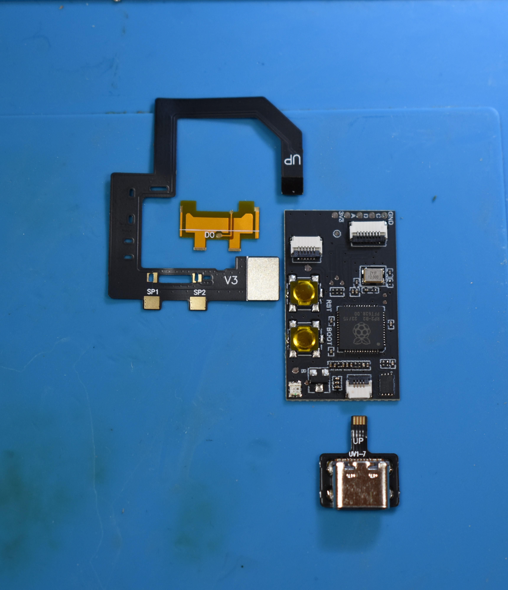
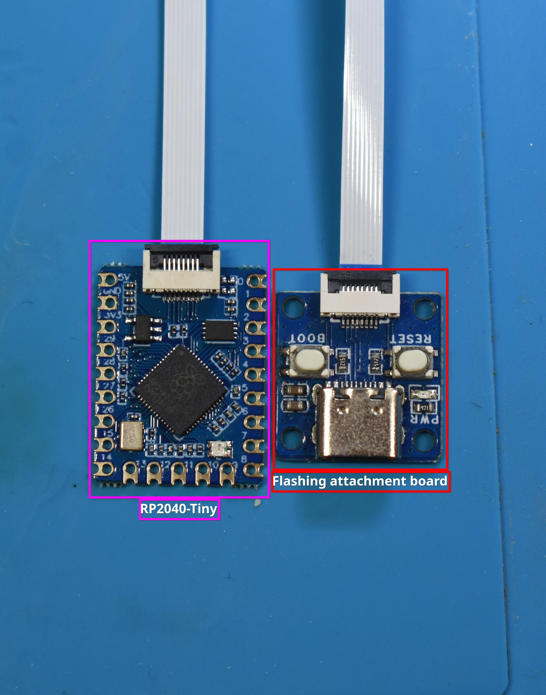

# **Modchip variants**

### **Information**

The "Picofly modchip" scene is very broad, and there are many "premade" Picofly modchip variants available. There are modchip variants that are specifically tailored to make installation 'easier' on different models of Switch (such as the "Picofly Core", "Picofly Lite" and "Picofly OLED" variants) but the QC (Quality Control) of many premade modchip variants is lackluster and is generally speaking not 'great'. 

This does not mean you cannot use them, but I would discourage you from using the "Picofly Core" and "Picofly Lite" modchip variants due to the frequent QC issues i've had with them. Besides that, manually soldering wires to the pads on the Switch motherboard is also more reliable over the premade "ABCD" ribbon cables. The SoC ribbon cables are fine to use however.

For the sake of simplicity, the modchip "variants" we will be covering in this guide are:

- Picofly OLED
- RP2040-Tiny

These boards can be obtained/bought on AliExpress, eBay or Amazon. Do note that buying them from eBay or Amazon means you are likely overpaying compared to ordering from AliExpress.

#### **Product links**

- AliExpress [Picofly OLED](https://aliexpress.com/w/wholesale-rp2040-switch.html).
- Waveshare [RP2040-Tiny](https://www.waveshare.com/product/rp2040-tiny.htm?sku=24665). 
    * Get the `RP2040-Tiny-Kit` version unless you already have the flashing attachment board.

Please refer to the [Modchip Information](#modchip-information) section below for visual references.
    
These dev boards are compatible with *ALL* Switch models (`HAC-001`, `HAC-001(-01)`, `HDH-001`, `HEG-001`).

!!! warning "Note regarding the SoC ribbon cable for V1 consoles"
    The "premade" SoC ribbon cables for V1 consoles will not be long enough to directly plug into the Picofly OLED modchip variant and the `RP2040-Tiny` simply lacks the FPC port that premade modchips have. More information on this will be mentioned at the relevant section on the [Modchip installation Switch](normal.md#if-your-soc-ribbon-cable-is-too-short-or-you-use-an-rp2040-tiny-development-board-you-cannot-plug-into-the-modchip-directly-to-make-it-work-regardless-you-can-just-solder-a-wire-to-the-two-middle-pins-of-the-ribbon-cable-as-pictured-below) page, at the bottom of the SoC ribbon cable installation.
    
!!! danger "Do you still want to install a Picofly Core modchip?"
    If you still wish to install a Picofly Core modchip on your normal model console, you can. This branch of the guide was moved to the [Legacy](../legacy/legacy) tab.

-----

### **Modchip Information**

=== "Picofly OLED"

    Picofly OLED is the modchip model originally meant for "OLED" Switch consoles, but it can be used with any model of Switch. This modchip is positioned on top of the the RAM section of the SoC/RAM "IHS" (Internal Heat Spreader) once installed.
    
    !!! danger "For this modchip, you will need to consider the following:"
    
        - If you are planning on modchipping a V1 console, please make sure you buy a V1 SoC ribbon cable. The SoC ribbon cable that comes with this modchip is *only* compatible with V2 consoles (Normal, Lite and OLED models).
    
    !!! info "This is what it looks like:"
    
        { loading=lazy }

=== "RP2040-Tiny"

    Picofly was originally based off of the stock `RP2040-Tiny` and `RP2040-Zero` development boards, which are still considered the most reliable Picofly modchip due to the quality control of these development boards. This modchip is positioned on top of the the RAM section of the SoC/RAM "IHS" (Internal Heat Spreader) once installed.
    
    !!! danger "For this modchip, you will need to consider the following:"
    
        - You will need to buy the `RP2040-Tiny` together with its "flashing attachment", so you can actually flash the RP2040 with firmware on the next page.
        - You will likely want to buy an SoC ribbon cable, for the `SP1`/`SP2` capacitors on the SoC.
        - If you are planning on modchipping a Switch OLED, you will also need to buy a DAT0 adapter if you go with the [DAT0 Adapter method](dat0-adapter) later in the guide.
        - You *may* want to buy a single 200 Ohm 0201 resistor in case your console is 'picky'. You would replace the 47 ohm resistor on the DAT0 line of the development board with this resistor. 
            
    !!! info "This is what it looks like:"

        { loading=lazy }

Once you're done, continue to the next page using the button below.

[Continue to Flashing the modchip :material-arrow-right:](flashing_modchip.md){ .md-button .md-button--primary }
