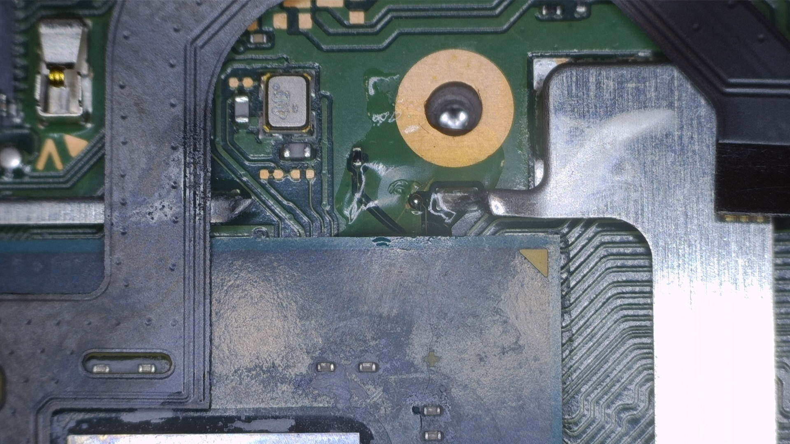
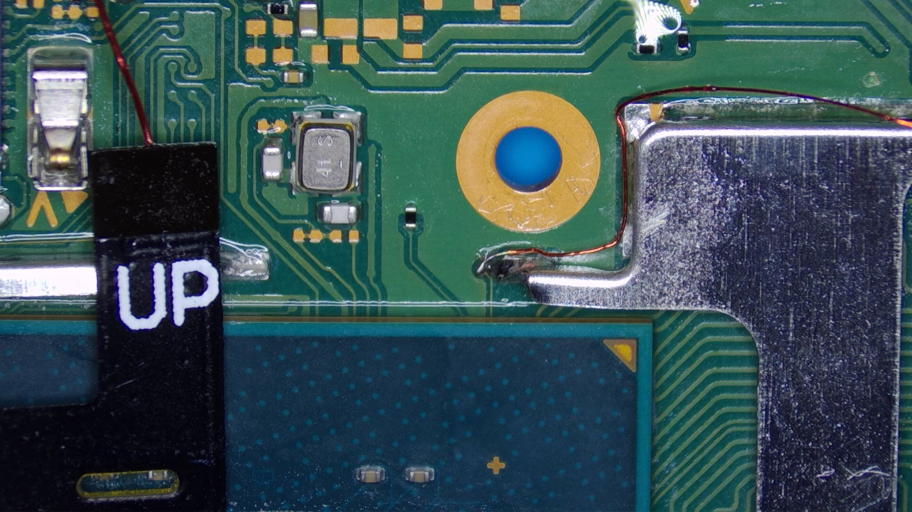
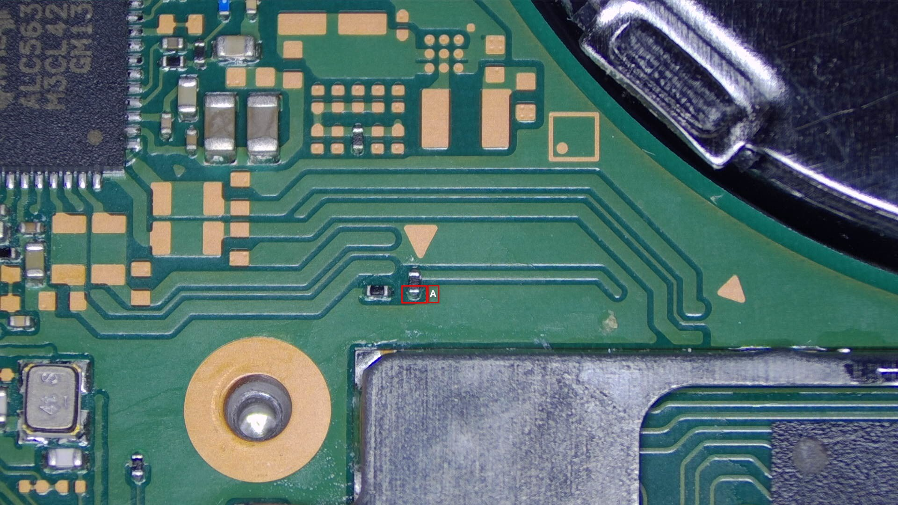
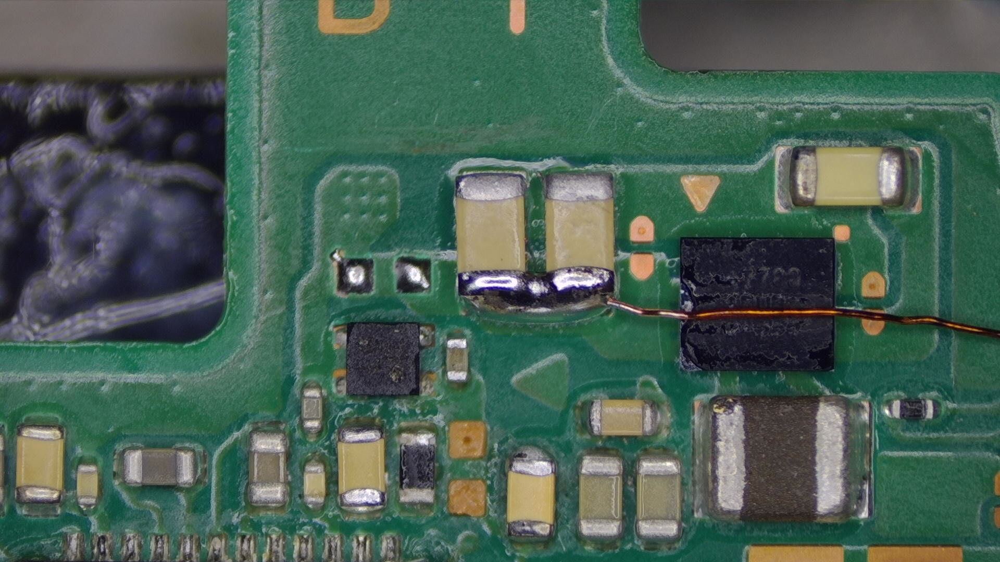
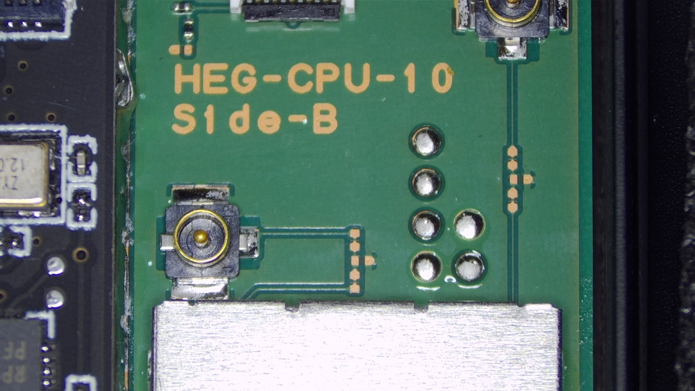
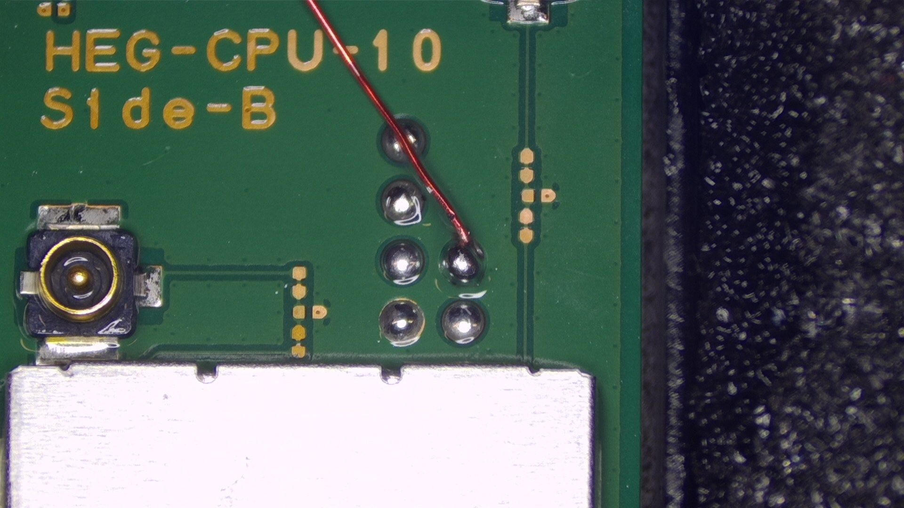
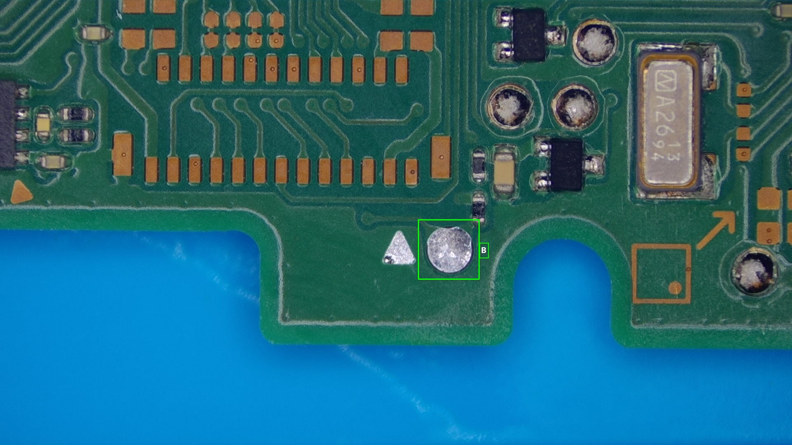
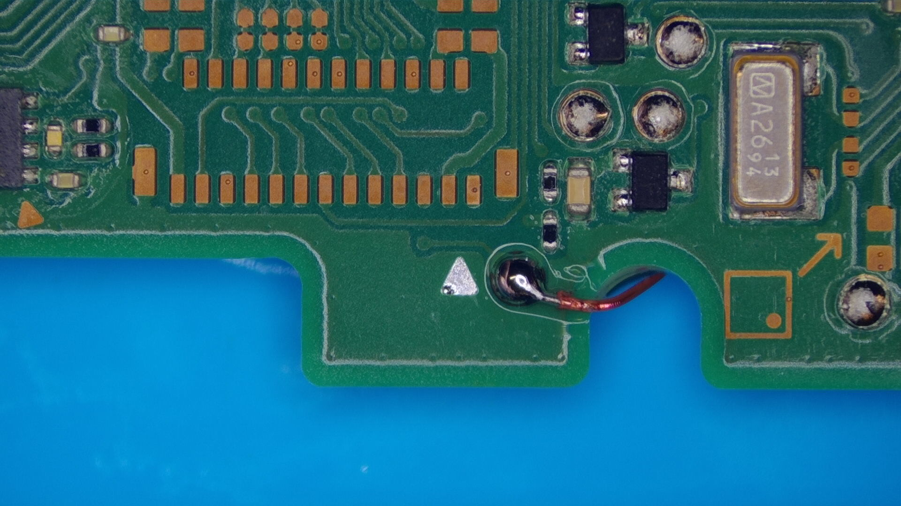
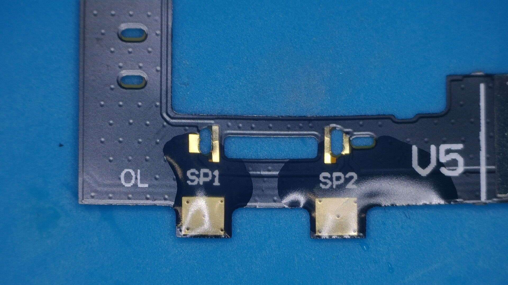

---
hide:
  - navigation
  - toc
---

### **The Installation**

This page will guide you through the modchip installation process on "OLED" model Switch consoles. Everything you need will be listed and pictures of what your solder joints should (roughly) look like will be posted by each step.
Specific steps such as photos of the screws you need to unscrew aren't mentioned here as they can be found on guides from iFixit (for example). It's expected for you to know what to unscrew.

-----

#### Diode reading values

These values can differ from console to console. If your modchip installation works fine and doesn't match these exact values, it's not an issue. These values can act as "indicators" about what you might expect. Especially the `C` (DAT0) point can have a large range of acceptable values.

| Positive to ground        | Negative to ground           |
| ------------------------- | ---------------------------- |
| **SP1** `~0.420`          | **SP1** `~0.520`             |
| **SP2** `~0.25`           | **SP2** `~0.20`              |
| **A** (CMD) `~0.470`      | **A** (CMD) `~0.875`         |
| **B** (RST) `~0.405`      | **B** (RST) `OL`             |
| **C** (DAT0) `~0.435`     | **C** (DAT0) `~0.450-0.850`  |
| **D** (CLK) `~0.440`      | **D** (CLK) `~0.880`         |
| **3.3v** `~0.445`         | **3.3v** `~0.850`            |

#### Requirements:

- A soldering iron with a small(er) tip (preferably temperature controlled that can reach 350C consistently)
- Good quality flux
- The right screwdriver bits (+00 and Y1.5 bits)
- Good quality 30-32 awg wire (such as Kynar wire, other wire can work as long as it's single core)
- Thermal paste (preferably non-conductive)
- Isopropyl Alcohol (preferably 95-99% IPA)
- Your modchip (including the SoC ribbon cable and DAT0 adapter)
- Kapton tape (optional, but recommended)
- A dental pick or other thin and sharp tool (to scrape away the top layer of the PCB for the D point)
- Toothpicks/Q-tips (to remove the thermal paste between the capacitors on the SoC)
- Soldering tin (leaded is recommended, unleaded will work depending on your skill level)
- Double sided tape
- A fume extractor (for your own health and safety)
- A microscope (optional but recommended)
- UV Solder mask (optional but recommended)

#### Additional and/or optional requirements for the Kamikaze method:

- A grinding pen such as the `MaAnt D2` with 0.2mm tip (Kamikaze method users **ONLY**)
- 32-36 awg magnet/enameled wire (Kamikaze method users **ONLY**)
- Solder with the width of 0.8mm or smaller
- A soldering iron tip like the `TS-J02`
- UV Solder mask
- UV Light

!!! danger "The Kamikaze method"
     The Kamikaze method is *also* covered on this page, be aware that this is a ***VERY*** risky procedure and that you should not attempt this without the required skills/tools. You will find the divide between the DAT0 Adapter and Kamikaze methods at step 14.

??? note "Note for stock RP2040 Zero development board users"
     If you use a stock `RP2040 Zero` development board, you will need to desolder the USB-C port,`BOOT` and `RESET` buttons before continuing. You'll also need to purchase the SoC ribbon cable separately together with 5x `0805 47Ω +-1%` resistors (5x is recommended, 3x is possible in some instances).
     The resistors can be purchased on AliExpress or websites like Digikey or Mouser Electronics. The SoC ribbon cable can be purchased from AliExpress.

#### Instructions:

1. Unscrew the Switch's backplate.

2. Remove the metal shield/cover (be careful with the antennas that are routed across the metal shield/cover) and disconnect the battery at the bottom right of the motherboard.

3. Remove the Gamecard reader/SD card reader board.

4. Remove the heatpipe/heatsink.

5. Remove the IHS (Internal Heat Spreader) to expose the bare SoC die and RAM chips.

6. Remove and clean up the thermal paste on the SoC die and around/in-between the capacitors on the SoC using IPA.
       - You can also clean off the thermal paste between the IHS and heatpipe/heatsink in the meantime, the red-ish colored thermal goop between the heatpipe/heatsink and metal shield/cover can be left alone.

7. Remove the fan and unplug the fan ribbon cable, joycon rail ribbon cables, screen ribbon cable and speaker connectors.

8. Unscrew and remove the bottom bar of the shell.

9. Remove the motherboard from the Switch casing.

10. Remove the metal plate covering the eMMC chip on the back of the motherboard. (Only for people following the DAT0 adapter method.)

11. Turn the motherboard back around, remove a part of the SoC/RAM frame next to the `D`(CLK) point and scrape away the `D`(CLK) point on the motherboard using a thin and sharp metal tool until the pad underneath is visible and open to the air (otherwise you won't be able to follow along with the next step).

12. Tin the `D`(CLK) point and wire, then solder a piece of your wire to the `D` point and solder it to the `D` point on the modchip.

      - **Optional:** Use UV solder mask on the `D` point. It's a very fragile point and is not something you want to have to potentially resolder in the future.  
      
      

13. Tin your wire and solder a piece of wire to the bottom end of the `A`(CMD) resistor, then solder the other end of the wire to the `A` point on the modchip. Be careful, as heating this resistor up too much has the chance to kill the resistor or will cause it to stick to your soldering iron and wipe it off of the motherboard completely (this only happens if your soldering iron is too hot and hold it on the resistor for too long).

      - **Optional:** Use UV solder mask on the `A` point. It's a very fragile point and is not something you want to have to potentially resolder in the future.  
      
        

14. ### **`C`(DAT0) Point methods**

      

      -   ### **DAT0 Adapter method (Recommended)**
      [Continue to DAT0 Adapter method :material-arrow-right:](dat0-adapter.md){ .md-button .md-button--primary }

      -   ### **Kamikaze method (ADVANCED USERS ONLY!)**
      [Continue to Kamikaze method :material-arrow-right:](kamikaze-method.md){ .md-button .md-button--primary }

      

 

15. Now, we will locate the `3.3v` capacitors near the top-middle on the front of the motherboard. Solder a piece of wire to the bottom end of the right capacitor and solder the other end of the wire to the `3.3v` pad on the modchip.

16. Locate the `GND` (ground) pad on the middle-right side of the motherboard. Solder a piece of wire to it and solder the other end of the wire to the `GND` pad on the modchip.

17. Turn the motherboard back around and locate the `B` point on the back of the motherboard. It's located at the very bottom of the motherboard, to the left of the C shaped "cutout" for the left speaker cable.
Solder a wire to the `B` point and solder the other end of the wire to the `B` point at the bottom of your modchip.

18. Apply flux and pre-tin the pads labeled `SP1` and `SP2` on the SoC ribbon cable.

19. Place the SoC ribbon cable and align the ribbon cable with the capacitors on the SoC.

20. Tuck the anker points underneath the metal frame below the SoC and the MOSFET section of the ribbon cable underneath the frame between the SoC and RAM, then solder the ribbon cable down once lined up correctly.  
    Apply flux and use your soldering iron to heat up the end of each capacitor together with the respective pad next to both ends of each capacitor of the `SP1` and `SP2` points, ensure the solder flows between the pad on the ribbon cable and end of the capacitor.

21. Your ribbon cable should now be secured in place with both ends of each capacitor soldered to the pads on the ribbon cable.
      - **Optional:** Place Kapton tape across your solder joints to prevent thermal paste from potentially corroding your solder joints in the future. It also helps in cases where you might have to rework your solder joints.  

22. Plug the SoC ribbon cable into the port on the top left of the modchip, make sure you lift the locking tab up first before inserting it. Once inserted, lock the locking tab again.

23. Modify the IHS to make the SoC ribbon cable fit out of the top of the SoC section of the IHS and reinstall the IHS. (Don't forget to apply thermal paste in between the SoC and IHS!)

24. Place a piece of double sided tape on top of the RAM section of the IHS, then place the modchip on top of it to secure it in place. Make sure no components (such as the SoC ribbon cable and wires you soldered onto the modchip) are under any kind of stress when doing this.

25. Your Switch should now look like the image below. If it does, you can re-connect the battery connector, power button board and screen ribbon cable and power the console on. After the modchip glitches and trains (blinks blue, then white), you should be greeted with the `No SD Card` splash screen with the Picofly logo.

26. Place a piece of Kapton tape (or other non-conductive material) on top of the modchip and reassemble the console.

27. Turn the Switch on and you should still end up at the `No SD Card` splash screen. If so, you've successfully followed and finished this guide.

-----

#### What's next?

From here, if you get the same result as I did, you can continue following the NH Server guide to set up CFW by clicking the button below. If you want to know more about the functionality of modchips, visit the [**Functionality of modchips**](../functionality/functionality_of_modchips.md) page.

If you'd like to donate to me, visit the [**Credits**](../credits/credits.md) section.

[Continue to the NH Server guide :material-arrow-right:](https://switch.hacks.guide/){ .md-button .md-button--primary }

!!! danger ""
    If you didn't get the same result as I did and are running into issues, please follow the troubleshooting section of this guide.
    It can be found [here](../troubleshooting/error_codes.md).
