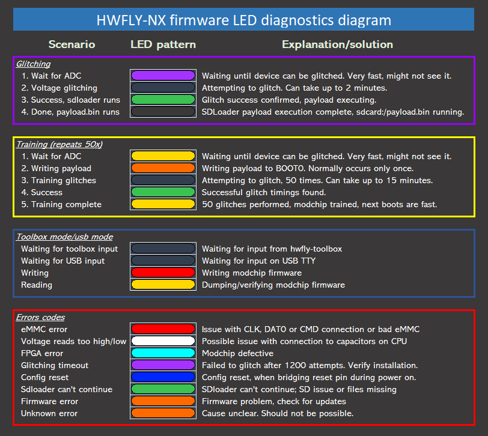

### **Information**

Are you experiencing issues after your modchip installation? Is your modchip giving you an error code you can't make sense of? Then this is the page for you.

Your modchip will give you error codes if there is an issue with the installation. These error codes consist of long/short pulses of LED patterns and sequences. Troubleshooting these error codes can be done by comparing them to existing/known error codes and will hopefully solve the issue you're experiencing.

-----

### **Error codes for Picofly**

The following information was obtained from [this github repository](https://github.com/Ansem-SoD/Picofly) and was slightly modified by me:

#### **As of firmware 2.70 and above, the debug LED colors and sequences/codes have changed.**

Now the possible status indicators will only consist of 3 colors:

- Blue (glitching),
- White (writing payload or success),
- Yellow (error code).

This was made possible by using Pi Pico debugging and getting rid of RGB/GRB issues.

#### **Known error codes (`=` is a long pulse, `*` is a short pulse):**

`=` USB flashing done.

`**` RST (`B`) is not connected.

`*=` CMD (`A`)is not connected.

`=*` D0 (`C`/`DAT0`) is not connected.

`==` CLK (`D`) is not connected.

`***` No eMMC CMD1 response. (Bad eMMC?)

`**=` No eMMC block 1 read. (Should not happen.)

`*==` Bad wiring/cabling, typically has to do with the top ribbon cable that connects `3.3v`, `A`, `B`, `C`, `D` and `GND` pads. (Which is why I don't recommend using that ribbon cable.)

`*=*` No eMMC block 0 read. (eMMC init failure?)

`=**` eMMC initialization failure during glitching process.

`=*=` CPU never reach BCT check, should not happen. Typically caused by the SoC ribbon cable not being seated properly.

`==*` CPU always reach BCT check (no glitch reaction, check MOSFET/SoC ribbon cable).

`===` Glitch attempt limit reached, cannot glitch

`=***` eMMC initialization failure

`=**=` eMMC write failure - comparison failed

`==` eMMC write failure - write failed

`=*==` eMMC test failure - read failed

`==**` eMMC read failed during firmware update

`==*=` BCT copy failed - write failure

`===*` BCT copy failed - comparison failure

`====` BCT copy failed - read failure

-----

### **Splash screen troubleshooting**

!!! note "**Question:** It says `Failed to init SD Card!` when I turn my console on, what do I do?"

    **Answer:** Make sure your SD card is inserted fully. If it is, your Switch's SD card reader may be malfunctioning. Test it with another SD card and if it also doesn't work, check the FPC port on the motherboard and SD card reader connector for any missing pins (Normal model Switch users). The SD card reader/game card reader board may need to be replaced if on an OLED Switch and the soldered on SD card reader may have to be replaced if on a Switch Lite.

!!! note "**Question:** It says `Payload size too large!` when I turn my console on, what do I do?"

    **Answer:** Make sure the payload size is less than 122KB. If you get this error, you're *very* likely using the wrong payload and should re-read the instructions mentioned in the NH-Server guide.

!!! note "**Question:** It says `Failed to mount SD Card!` when I turn my console on, what do I do?"

    **Answer:** Your SD card isn't formatted and/or partitioned correctly. The payload *has* to be placed on the first partition of the SD card and *has* to be formatted as `FAT32` or `exFAT` (`FAT32` being the best option out of the two) for the SD card to be able to be mounted (accessible for the modchip and `sdloader`). Another cause of this issue can be due to SD card corruption and would require you to perform SD card integrity checks, for which a guide on how to do so can be found [here](https://wiki.hacks.guide/wiki/Checking_SD_card_integrity).

-----

### **Stock Picofly development board users**

This section is only useful for the stock development board users.

The second major feature is CPU downvoltage. This might be useful when your MOSFET (or the wire) is not thick enough for the glitching process. (Do you remember the case where you would press the "RESET" button on the RP2040 development board when the joycon logo appeared to make it work? That's it, the system lowers CPU voltage for glitching to work.)

You can solder two additional wires to your development board so it can lower the CPU voltage making the glitching process easier. This is optional and only something you should do if you really need to.

- Waveshare RP2040 Zero: `SDA = 12, SCL = 13`

- Raspberry Pi RP2040 Pico: `SDA = 19, SCL = 20`

- XIAO RP2040: `SDA = 3, SCL = 4`

- ItsyBitsy RP2040: `SDA = 18, SCL = 19`

-----

!!! tip ""
    **If you still experience errors with your Picofly modchip, visit the #switch-assistance-1 or #switch-assistance-2 channels in the NH-Discord server <a href="https://discord.gg/C29hYvh">here</a>**.

-----

### **Error codes for Hwfly**

The following information was obtained from [this github repository](https://github.com/hwfly-nx/firmware):

- Note: We do *not* assist with Hwfly/Instinct-NX based modchips in the NH Discord server. This section solely exists for your own troubleshooting purposes.

